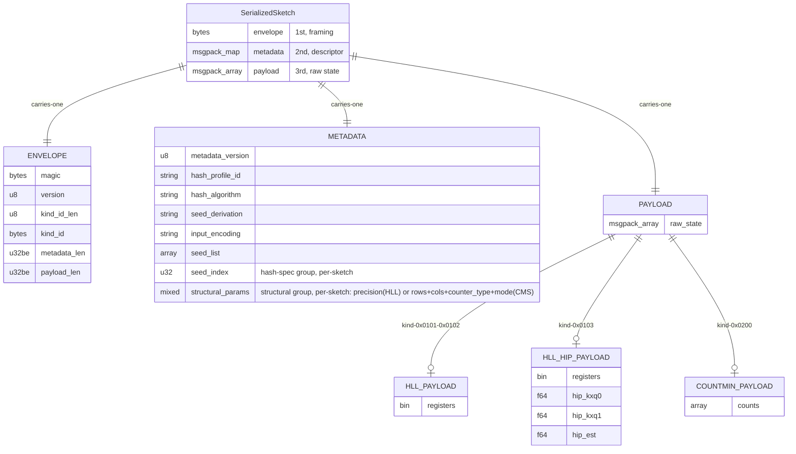

# ASAPv1 Wire Format: Design Doc

## What this is

ASAPv1 is ProjectASAP's self-describing binary format to serialize sketches in `asap_sketchlib`.
It fixes the exact bytes written when a sketch (HyperLogLog, Count-Min, and so on) is saved or shipped, so any process or language (Rust today, Go next) can decode it, confirm it was hashed compatibly, and merge or query it.
This doc describes that byte layout at a high level; the byte-exact encoding rules live in Section 4, and the implementation notes (decoder validation, converting an in-memory sketch) live in Section 5.

## Which parts to read

If the doc feels long, these sections carry the key points:

- [**Section 1, Envelope**](#section-1-envelope): the Layout table.
- [**Section 2, Metadata**](#section-2-metadata): the fields table, the hash-spec table, the structural-params table.
- [**Section 3, Payload**](#section-3-payload): the HLL payload and the Count-Min payload.

## Terms

- **Envelope**: the header that wraps the metadata and payload (`magic | version | kind_id | length-prefixes`). Sketch-agnostic framing; it is not the whole binary.
- **Metadata**: the descriptor (msgpack map) holding the hash spec (how the sketch was hashed) plus the structural params needed to read the payload.
- **Payload**: the sketch's raw state (registers, counters, and so on), a positional msgpack array. The per-sketch-authored part.
- **kind / kind_id**: an id naming the algorithm (e.g. `0x02 0x00` = Count-Min); 2 bytes today, extendable to more since `kind_id_len` is a byte. The registry maps id to name to payload shape.
- **Hash profile**: the identified set of hash constants (algorithm, seeds, seed indices) a sketch was built with, carried in the metadata so the bytes are truthful (`HashProfile` trait in Rust).
- **seed_list**: the array of hash seeds, carried inline in every sketch's metadata so the bytes self-describe the hash with no registry lookup.
- **wire-eligible**: a sketch config the format can serialize. The wire covers a fixed subset of the freer in-memory types; a config outside that subset is converted to a covered one first (Section 3.2, Section 5).

## Status

- **Implementing (Rust).** HLL and Count-Min serialize through the shared `message_pack_format::envelope` module per this spec.
- **Self-describing.** The hash-spec metadata is derived from the hasher's `HashProfile` (read live, never hardcoded), so the bytes truthfully describe how a sketch was hashed; custom hash profiles are supported (Section 2).
- **Byte-level encoding** is pinned in Section 4; the resolved decisions are summarized at the end.
- **`sketchlib-go`** is aligned separately (see Cross-language contract).

## Layering

| Layer | Scope | Self-describing? | Owner | Changes when |
| ------- | ------- | ------------------ | ------- | -------------- |
| **Envelope** | frame | yes | one shared module | the framing changes (rare) |
| **Metadata** | descriptor (hash spec + structural params) | yes | one shared module | the hash profile or a sketch's params change |
| **Payload** | one per sketch | **no** | each sketch | that sketch's raw encoding changes |

Every serialized sketch carries its own envelope, metadata, and payload.
What differs is **who authors each part**: the envelope framing and the metadata schema are shared and sketch-agnostic (one module, identical across all sketches), while the payload layout is defined per sketch.
Values still vary per sketch: each blob carries its own precision, rows/cols, register bytes, and so on.

```text
+-------------------------------+
| Envelope | Metadata | Payload |
+-------------------------------+
```

### Guiding principle

In the byte stream, `kind_id` and `metadata` come **before** the `payload`.
By the time the decoder reaches the payload it already knows both, and together they fix the payload's structure completely.
So the payload carries **raw state only**: no field names, no tag that `kind_id` or the metadata already carries, no derived quantities.
If a payload looks complicated, either the sketch genuinely has that much state, or something derivable/redundant leaked in and should be removed.

### Structure

A serialized sketch is one envelope, then one metadata, then one payload.



---

## Section 1: Envelope

A flat, sketch-agnostic frame.
It answers, with zero knowledge of the sketch: *is this ours?* (magic), *how do I parse the frame?* (version), *what algorithm?* (kind_id).
The envelope is essentially **constant** across sketches; only `kind_id` and the two length fields differ.

### Layout

```md
[ magic:6 | version:u8 | kind_id_len:u8 | kind_id:bytes
          | metadata_len:u32_be | payload_len:u32_be
          | metadata:msgpack | payload:msgpack ]
```

| Field | Type | Value / range | Notes |
| ------- | ------ | --------------- | ------- |
| `magic` | 6 bytes | `41 53 41 50 76 31` = `b"ASAPv1"` | fixed sentinel |
| `version` | u8 | `0x01` | envelope layout version; this doc = `0x01` |
| `kind_id_len` | u8 | `2` today (<=255) | length of `kind_id` |
| `kind_id` | bytes | see registry | which algorithm |
| `metadata_len` | u32 be | varies | byte length of the metadata block |
| `payload_len` | u32 be | varies | byte length of the payload |
| `metadata` | msgpack map | varies | Section 2 |
| `payload` | msgpack array | varies | Section 3 |

**`payload_len`** makes the envelope a self-delimiting record (needed to ever place a sketch inside a larger container).
`metadata_len` is variable only because the metadata is a variable-length msgpack map (Section 2); the length fields are pure framing and do not depend on the sketch.

### The `kind_id` scheme

#### Design choice: `kind_id` refers to **algorithm level**

Count-Min is **one** kind_id: its counter type (i64/f64) and mode (fast/regular) live in the metadata, so the id stays the same across them.
Classic and Ertl-MLE have byte-identical payloads but are separate ids because `kind_id` also selects the *estimator* to apply.

#### Design choice: a numeric `kind_id` (string form left open)

The wire carries the compact `kind_id` and resolves the algorithm name through the registry below; it does not encode a raw string like `"HyperLogLog-Classic"`.
The registry is the single place that maps id to name; the door is left open to switch to a string scheme later if it ever earns its keep.

#### `kind_id` structure

Today `kind_id` is `[family, variant]` and names the sketch's **algorithm** (its parameters live in the metadata):

- **family** (byte 1) picks the sketch type: `0x01` = HLL, `0x02` = Count-Min, and so on.
- **variant** (byte 2) picks the algorithm within that family; for HLL, Classic vs Ertl-MLE vs HIP.

**Allocation rules:**

- `kind_id` is **variable-length** (`kind_id_len` is a u8), so the id space is effectively unbounded; it can keep growing forever, and we will never run out.
- A `kind_id` is **allocated once and never recycled.** When an algorithm is retired, its id stays reserved permanently; reusing a retired number would make a new decoder silently misread old bytes.
- A **new incompatible payload encoding gets a new `kind_id`** (Q-VER: versioning lives in the id, which keeps payloads minimal; the payload has no version field of its own).

### kind_id registry (single source of truth, mirrored verbatim in `sketchlib-go`)

The **family** bytes match `sketchlib-go`'s `wire/asapmsgpack/magic_ids.go` verbatim; `0x0a`+ are new allocations for sketches in [`apis.md`](./apis.md) that Go has not assigned yet.
Only the HLL variants and Count-Min have designed payloads today; every other row reserves its family byte with variant `0x00` and payload **TBD**.
Variant sub-ids are not invented ahead of a payload design; a family that later needs several algorithms allocates its variants when it is designed (as HLL did).
This registry is the master list of algorithms still to design payloads for.

| kind_id | Sketch | Algorithm / variant | Payload | Status |
| --------- | -------- | --------- | --------- | -------- |
| `0x01 0x00` | HLL | Unspecified | - | reserved |
| `0x01 0x01` | HLL | Classic ("Regular") | Section 3.1 | implemented |
| `0x01 0x02` | HLL | Ertl-MLE ("Datafusion") | Section 3.1 | implemented |
| `0x01 0x03` | HLL | HIP | Section 3.1 | implemented |
| `0x02 0x00` | Count-Min | Count-Min | Section 3.2 | implemented |
| `0x03 0x00` | Count-Min-with-heap (CMSHeap) | - | TBD | assigned in Go / payload not designed |
| `0x04 0x00` | Count Sketch | - | TBD | assigned in Go / payload not designed |
| `0x05 0x00` | DDSketch | - | TBD | assigned in Go / payload not designed |
| `0x06 0x00` | KLL | - | TBD | assigned in Go / payload not designed |
| `0x06 0x01` | KLL dynamic | - | TBD | assigned in Go / payload not designed |
| `0x07 0x00` | Hydra-KLL | - | TBD | assigned in Go / payload not designed |
| `0x08 0x00` | SetAggregator | - | TBD | assigned in Go / payload not designed |
| `0x09 0x00` | DeltaResult | - | TBD | assigned in Go / payload not designed |
| `0x0a 0x00` | Count-Sketch-with-heap (CSHeap) | - | TBD | reserved / not designed |
| `0x0b 0x00` | Elastic (`Unstable`) | - | TBD | reserved / not designed |
| `0x0c 0x00` | Coco (`Unstable`) | - | TBD | reserved / not designed |
| `0x0d 0x00` | UniformSampling (`Unstable`) | - | TBD | reserved / not designed |
| `0x0e 0x00` | KMV (`Unstable`) | - | TBD | reserved / not designed |
| `0x0f 0x00` | HashSketchEnsemble | - | TBD | reserved / not designed |
| `0x10 0x00` | UnivMon | - | TBD | reserved / not designed |
| `0x11 0x00` | UnivMon Optimized | - | TBD | reserved / not designed |
| `0x12 0x00` | NitroBatch | - | TBD | reserved / not designed |
| `0x13 0x00` | ExponentialHistogram | - | TBD | reserved / not designed |
| `0x14 0x00` | EHSketchList | - | TBD | reserved / not designed |
| `0x15 0x00` | EHUnivOptimized (`Unstable`) | - | TBD | reserved / not designed |
| `0x16 0x00` | OctoSketch | - | TBD | reserved / not designed |

**Mapping notes** (mismatches between `apis.md` and Go's `magic_ids.go`):

- **CMSHeap vs CSHeap.** Go's `MagicCountMinSketchWithHeap` (`0x03`) is the Count-*Min*-with-heap sketch (`apis.md` to CMSHeap). The Count-*Sketch*-with-heap sketch (`apis.md` to CSHeap) is a distinct family and gets a fresh byte (`0x0a`), separate from `0x03`.
- **Hydra.** `apis.md` lists the "Hydra" framework; Go's only Hydra id is `MagicHydraKLLSketch` (`0x07`), so Hydra maps here to the Hydra-KLL id. If Hydra is later wrapped around a non-KLL base sketch, that combination gets its own id.
- **SetAggregator / DeltaResult** (`0x08` / `0x09`) come from Go's `magic_ids.go` and do not appear as sketches in `apis.md` (they are aggregation and delta-result envelopes, distinct from stand-alone sketches). They are kept here so the family space stays mirrored verbatim with Go.
- **`Unstable`** rows mirror the `Unstable` status those sketches carry in `apis.md`; their kind_id is reserved but the payload (and the sketch API) may still change.

### Decoder rules

1. `len >= 6+1+1+0+4+4` before reading anything.
2. `magic` matches, else reject.
3. `version` is known, else reject (no best-effort parse).
4. Read `kind_id`; the per-sketch decoder rejects any `kind_id` it does not own.
5. Read `metadata`; validate it against the target type's profile (Section 5, Validation).
6. Cross-check metadata against `kind_id` and the payload, so structural params stay consistent (Section 5, Validation).
7. Read exactly `payload_len` bytes; hand to the per-sketch payload decoder.
8. Fail **closed** on any inconsistency; never merge or query a sketch whose hash spec did not validate.

> Implementation note: the shared envelope module (`src/message_pack_format/envelope.rs`) owns rules 1-3 and the byte framing (`encode` / `split`); it is sketch-agnostic and does not know the registry.
> Rule 4 (and metadata/kind_id validation) happens in each sketch's decoder, which checks the `kind_id` against the ones it owns.

---

## Section 2: Metadata

The **descriptor**: the configuration of a sketch algorithm.
Two groups of fields:

- **Hash spec**: how keys were hashed (so two sketches can be checked mergeable and a query key hashed the same way). Profile-derived.
- **Structural params**: parameters that shape the payload (HLL precision, CMS counter type, CMS mode). Per-sketch, per-algorithm.

**Simple rule:** anything you configure when creating a sketch goes in the metadata.

### Encoding: msgpack **map** keyed by field name

- Metadata is a **msgpack map**, so a consumer reads fields by name (`"hash_profile_id"`) with no positional guesswork.
- The schema is fixed and closed: **each sketch has its own fixed metadata schema** (in Rust, one struct per sketch with `#[serde(deny_unknown_fields)]`).
- The field *set* differs per sketch: HLL carries `precision` + `canonical_seed_index`; Count-Min carries `rows`, `cols`, `counter_type`, `mode` + `matrix_seed_index`.
- Within a given sketch **every field is required**: a missing key, or an unexpected extra key, is **rejected (fail closed)**, never silently defaulted or skipped.
- **`seed_list` is inlined**, so the bytes self-describe the hash; a consumer reads the exact seeds straight from the binary, with no registry. (It costs ~130 bytes; resolving seeds from `hash_profile_id` via a registry is a v2 space optimization.)

### Fields

The metadata map is **two groups** of fields, written on the wire in this order: Hash spec first, then Structural params.

| Group | Role | Fields |
| ----- | ---- | ------ |
| **Hash spec** | how keys were hashed (check mergeability + re-hash a query key) | `metadata_version`, `hash_profile_id`, `hash_algorithm`, `seed_derivation`, `input_encoding`, `seed_list`, + the seed index(es) it uses |
| **Structural params** | parameters that shape the payload | `precision` (HLL); `rows`, `cols`, `counter_type`, `mode` (Count-Min) |

The two tables below are the field-by-field detail of each group.

**Hash spec**

| Key | Type | Required | Meaning |
| ------- | ------ | -------- | --------- |
| `metadata_version` | u8 | yes | schema version of *this block* (`1`). Independent of envelope `version`. |
| `hash_profile_id` | string | yes | stable global id `"projectasap.xxh3.seedlist.v1"`; authoritative |
| `hash_algorithm` | string | yes | `"xxh3_64_128"` |
| `seed_derivation` | string | yes | `"seed_list_index_wrap"` |
| `input_encoding` | string | yes | `"projectasap.input.v1"` |
| `seed_list` | `array<u64>` | **yes (inlined)** | the 20 seeds, carried inline so the bytes self-describe the hash |
| `canonical_seed_index` | u32 | **per-sketch** | index into `seed_list` (`5`); HLL uses it |
| `matrix_seed_index` | u32 | **per-sketch** | `0`; Count-Min uses it |
| `hydra_seed_index` | u32 | **per-sketch** | `6`; include only if used |
| `univmon_bottom_layer_seed_index` | u32 | **per-sketch** | `19`; include only if used |

**Structural params**

| Key | Type | Applies to | Meaning |
| ------- | ------ | -------- | --------- |
| `precision` | u8 | HLL | `12` / `14` / `16`; register count = `2^precision` |
| `rows` | u32 | Count-Min | matrix depth (number of hash rows) |
| `cols` | u32 | Count-Min | matrix width (number of columns) |
| `counter_type` | string | Count-Min | `"i64"` or `"f64"`; element type of `counts` |
| `mode` | string | Count-Min | `"fast"` or `"regular"`; key-to-column derivation |

Count-Min's matrix dimensions are **configuration** (they shape the payload, like HLL's `precision`), so per the config-to-metadata rule they live here.
Count-Min's canonical structural-param order is `... matrix_seed_index, rows, cols, counter_type, mode`; this is the wire contract and Go must mirror it verbatim.

### Standard ProjectASAP profile (reference values)

The hash-spec field *values* are read live from the hasher's `HashProfile`: `hll_metadata::<H>` / `cms_metadata::<H>` read `PROFILE_ID`, `ALGORITHM`, `SEED_DERIVATION`, `INPUT_ENCODING`, `seed_list()`, and the seed index straight off `H`.
The block below is the **standard profile**, the one `DefaultXxHasher` declares (the single source of truth for these values); it is also what the registry resolves `hash_profile_id` to.
A single sketch's metadata carries `hash_profile_id` plus only the subset of indices/params it uses.

```md
metadata_version = 1
hash_profile_id  = "projectasap.xxh3.seedlist.v1"
hash_algorithm   = "xxh3_64_128"
seed_list        = [0xcafe3553, 0xade3415118, 0x8cc70208, 0x2f024b2b, 0x451a3df5,
                    0x6a09e667, 0xbb67ae85, 0x3c6ef372, 0xa54ff53a, 0x510e527f,
                    0x9b05688c, 0x1f83d9ab, 0x5be0cd19, 0xcbbb9d5d, 0x629a292a,
                    0x9159015a, 0x152fecd8, 0x67332667, 0x8eb44a87, 0xdb0c2e0d]
canonical_seed_index            = 5
matrix_seed_index               = 0
hydra_seed_index                = 6
univmon_bottom_layer_seed_index = 19
seed_derivation  = "seed_list_index_wrap"
input_encoding   = "projectasap.input.v1"
```

### Custom hash profiles

Because the metadata is `HashProfile`-derived, a hasher that declares its own profile (a different `PROFILE_ID` / `seed_list()` / seed index) serializes **truthfully**; its own values land in the metadata.
Since `seed_list` is inlined, those bytes are **fully self-describing**: a consumer reads the exact seeds and algorithm straight from the binary, with no registry, even for a hash it has never seen.
This is safe on both ends because serialization **fails closed**:

- **Encode side (compile-time).** `serialize_to_bytes` is bounded on `H: HashProfile`, so a hasher that does *not* declare a profile simply cannot serialize; mislabeled bytes are impossible by construction.
- **Decode side (runtime).** Decode validates the metadata against the *target* type's `HashProfile`, so bytes hashed under profile A cannot be decoded into a profile-B-typed sketch; they are rejected (see Section 5, Validation).
- **Merge.** Merge compatibility is hash-spec equality (same `hash_profile_id` + seeds). A custom-profile sketch is not mergeable with a standard-profile one.

---

## Section 3: Payload

Per sketch. **Raw state only**, a **positional msgpack array** in the order its kind_id implies. Rules:

- No field that `kind_id` or the metadata already determines (no variant tag, no precision, no counter type, no mode).
- No field derivable from another (no HLL `precision`; no CMS `l1`/`l2`, which are `sum(count)` / `sum(count^2)` and are recomputed on decode).
- msgpack array (positional), never a keyed map. The exact msgpack types are in "Wire encoding rules".

> Note: derived summaries like CMS `l1`/`l2` and `sum_counts`/`sum2_counts` live in the **delta / error-accounting** format (proto `CountMinState`), a separate wire format.
> They do not belong in the self-contained sketch payload.

### 3.1: HLL payload (`0x01 0x01` / `0x01 0x02` / `0x01 0x03`)

The variant is in `kind_id`, precision is in the metadata (and equals `log2(register count)`), so the only real state is the register bytes (plus three running scalars for HIP).

**Classic / Ertl-MLE** (`0x01 0x01`, `0x01 0x02`), identical layout:

| Pos | Field | Type | Notes |
| ----- | ------- | ------ | ------- |
| 0 | `registers` | bin | one byte per register; length is `2^precision` |

**HIP** (`0x01 0x03`):

| Pos | Field | Type | Notes |
| ----- | ------- | ------ | ------- |
| 0 | `registers` | bin | one byte per register |
| 1 | `hip_kxq0` | f64 | HIP running estimate state |
| 2 | `hip_kxq1` | f64 | |
| 3 | `hip_est` | f64 | |

### 3.2: Count-Min payload (`0x02 0x00`)

The `CountMin` struct is generic in memory (counter `i32`/`i64`/`i128`/`f64`, `RegularPath`/`FastPath`, Nitro, and so on).
**That freedom is kept in memory; nothing is forbidden.**
The wire supports a fixed set. The two parameters that shape it, **counter type** (`"i64"`/`"f64"`) and **mode** (`"fast"`/`"regular"`), live in the metadata, so the payload itself is just shape and counters:

| Pos | Field | Type | Notes |
| ----- | ------- | ------ | ------- |
| 0 | `counts` | array | packed **row-major**, `rows*cols` cells; element type = `counter_type` |

`rows` and `cols` live in the metadata as structural params (Section 2), so the payload omits them.
The payload is a **1-element positional array `[counts]`**, mirroring HLL Classic's `[registers]`.

Wire counter types are `i64` and `f64` only (`i32` widens to `i64`; `i128` and exotic counters are not wire types).
`mode` records `RegularPath` vs `FastPath` because they place a key in different columns (compare `cm_regular_path_correctness` vs `cm_fast_path_correctness`), so a reader must know which to reproduce a query.
A counter type other than i64/f64, or non-`Vector2D` storage, must be converted first; see Section 5, "Converting an exotic in-memory sketch".
Both modes, `FastPath` and `RegularPath`, serialize directly (you'd only "convert" a mode to *change* it, which needs re-inserting the data).

### 3.3 onward: payloads not yet designed

The remaining `kind_id`s reserve a family byte with payload TBD (Section 1 registry has their "assigned in Go" status). Likely shape when designed:

| kind_id | Sketch | Likely payload |
| --------- | -------- | --------- |
| `0x03 0x00` | Count-Min-with-heap (CMSHeap) | similar to current CMS |
| `0x04 0x00` | Count Sketch | similar to current CMS |
| `0x05 0x00` | DDSketch | straightforward bucket |
| `0x06 0x00` | KLL | next on the list; no CDF serialization |
| `0x07 0x00` | Hydra-KLL | same challenge as KLL |
| `0x08 0x00` | SetAggregator | aggregation envelope, distinct from a stand-alone sketch (Section 1 mapping notes) |
| `0x09 0x00` | DeltaResult | delta-result envelope, distinct from a stand-alone sketch (Section 1 mapping notes) |
| `0x0a 0x00` | Count-Sketch-with-heap (CSHeap) | similar to current CMS |
| `0x0b 0x00` | Elastic (`Unstable`) | "key" needs thought, else similar to CMS; sketch needs optimization first, worth one combined PR |
| `0x0c 0x00` | Coco (`Unstable`) | "key" needs thought, else similar to CMS |
| `0x0d 0x00` | UniformSampling (`Unstable`) | straightforward |
| `0x0e 0x00` | KMV (`Unstable`) | straightforward |
| `0x0f 0x00` | HashSketchEnsemble | may not need serialization |
| `0x10 0x00` | UnivMon | more complex but doable |
| `0x11 0x00` | UnivMon Optimized | TBD |
| `0x12 0x00` | NitroBatch | may want another serialization abstraction in Storage |
| `0x13 0x00` | ExponentialHistogram | needs to re-use other sketches' serialization |
| `0x14 0x00` | EHSketchList | TBD |
| `0x15 0x00` | EHUnivOptimized (`Unstable`) | TBD |
| `0x16 0x00` | OctoSketch | TBD |

---

## Section 4: Wire encoding rules (byte-level)

This is what makes two languages emit **identical bytes**.
msgpack fixes endianness and float format; these rules fix the family/width choices that libraries otherwise make differently.

**Integer family + width rule (applies to every integer below).**
This is the single biggest cross-language trap: some Go msgpack libraries emit a *signed* `int` family for a positive `int64` while Rust's `rmp_serde` narrows it to the `uint` family. Pin it:

- A **non-negative** integer is encoded in the msgpack **uint** family, at the **minimal width** for its value (e.g. `300` gives `cd 01 2c`, uint16; `1` gives positive fixint `01`).
- A **negative** integer is encoded in the msgpack **int** family, minimal width.
- `f64` is always full **float64** (`0xcb`), never narrowed to float32.

The Go side MUST configure its encoder to match (uint-narrowing on, minimal width).
Golden byte-vectors lock it.

**Metadata (msgpack map)**

- Keys are the exact ASCII strings in Section 2.
- **Canonical key order** = the order fields are listed in Section 2 (hash-spec group, then structural-params group). Encoders MUST write in this order. (Order is irrelevant to decoding but required for byte-identical output.)
- Decoders reject **unknown keys** (Rust uses `#[serde(deny_unknown_fields)]`); v1 carries exactly the fixed field set (its values are the hasher's `HashProfile`: the standard profile or a custom one).
- Values: strings as msgpack `str`; `seed_list` as a msgpack array of integers (each per the family/width rule); all other integers per the family/width rule.

**Payload (msgpack array)**

- A msgpack **array**, elements in the Section 3 position order.
- `registers`: msgpack `bin` (one byte per register; matches Go's `[]byte`).
- `counts`: msgpack array; each element is an integer (per the family/width rule) when `counter_type == "i64"`, a **float64** when `"f64"`.
- HLL HIP `hip_*`: **float64**.

(Count-Min `rows` / `cols` are carried as metadata integers per the family/width rule; see Section 2.)

---

## Section 5: Implementation detail

Guidance for future development; this is outside the byte contract. It covers how a Rust decoder validates the bytes, and how to bring an in-memory config the wire doesn't cover directly onto the wire.

### Validation (decode side)

Fail **closed** on any mismatch:

1. `kind_id` is in the registry.
2. Every hash-spec field matches the **target hasher's** `HashProfile`: decode compares the read metadata against `hll_metadata::<H>` / `cms_metadata::<H>` for the exact type being decoded into, so it does not merely accept the standard profile. Bytes carrying a different profile are rejected.
3. Structural params are consistent with `kind_id` and the payload:
   - HLL: `registers.len() == 2^precision ==` the target storage's register count.
   - Count-Min: `counts` element type matches `counter_type`; `counts.len() == rows*cols`.

### Converting an exotic in-memory sketch to a wire form

The library provides no free wire serialization for exotic counters; only the owner knows if the mapping is lossless.
Convert to a canonical counter type, then serialize.
Doable **today** with existing public API (the pattern `SketchlibCms` already uses):

```rust
// e.g. a u64-counter FastPath CMS to the i64 wire form
let (rows, cols) = (src.rows(), src.cols());
let converted: CountMin<Vector2D<i64>, FastPath> = CountMin::from_storage(
    Vector2D::from_fn(rows, cols, |r, c| src.as_storage().query_one_counter(r, c) as i64),
);
let bytes = converted.serialize_to_bytes()?; // wire-eligible type
```

Converts the **counter type** only (cell-for-cell).
It does not convert the mode (Regular to/from Fast); that would need re-inserting the original data.

---

## Cross-language contract

Direction: **custom per-sketch payload replaces the `portable` types, and `sketchlib-go` mirrors each payload.**
Good direction (more compact, higher fidelity, less Rust-internal duplication), but it moves the contract from shared code to discipline. To keep it safe:

1. **This spec**: byte-level, language-neutral, per sketch.
2. **Golden byte-vector fixtures** checked into both repos; both languages decode and re-encode them byte-identically. These replace the `portable`-as-oracle round-trip test that guards drift today.
3. **This registry**, mirrored, never independently allocated.

**Hash profile on the Go side.**
Rust derives the hash spec from a generic `HashProfile` bound on the hasher type; Go has no generic hasher type, so there is nothing to derive from.
On the Go side the profile is simply **written into** the metadata on encode and **read from** it on decode.
Go MUST validate the profile it reads (same fail-closed intent as Rust): a sketch is only mergeable/queryable if its `hash_profile_id` + seeds match the profile Go is prepared to reproduce.

Sequencing: do not delete `portable` until (2) exists; the current `native bytes == portable bytes` test is the only drift guard right now.
Keep it through the transition, retire `portable` once goldens are in place.

---

## Decisions (resolved)

- **kind_id = algorithm identity** (parameters live in the metadata). Structural params (HLL precision, CMS counter type + mode) live in metadata, which is read before the payload. Payload structure = kind_id + metadata.
- **Q-META**: metadata is a msgpack **map**; canonical key order per Section 4; optional fields are omitted keys.
- **Q-SEEDS**: `seed_list` is **inlined** in v1 so the bytes self-describe the hash. Resolving seeds from `hash_profile_id` alone is a v2 space optimization. Each sketch still carries only the seed *index* it uses.
- **Q-PROFILE**: the hash-spec metadata is **derived from the hasher's `HashProfile`** (`hll_metadata::<H>` / `cms_metadata::<H>`) and never hardcoded, so it is always truthful to the hasher. Custom hash profiles are **supported and self-describing**. Merge compatibility is hash-spec equality, so a custom-profile sketch is not mergeable with a standard one.
- **Q-CMS**: Count-Min is one `kind_id` (`0x02 0x00`); counter type and mode live in the metadata, so the id stays single.
- **Q-CMS-DIMS**: Count-Min `rows`/`cols` are **metadata** and the payload omits them. They are configuration that shapes the payload (like HLL's `precision`), so per the config-to-metadata rule they belong in the descriptor. The payload is then just `[counts]`. Canonical structural-param order: `... matrix_seed_index, rows, cols, counter_type, mode`.
- **Q-VER**: no payload version field. A new incompatible encoding gets a **new `kind_id`**; retired ids are reserved forever and never recycled.
- **Encoding**: metadata + payload are both msgpack; payload is a positional array. Byte-level rules in Section 4.
