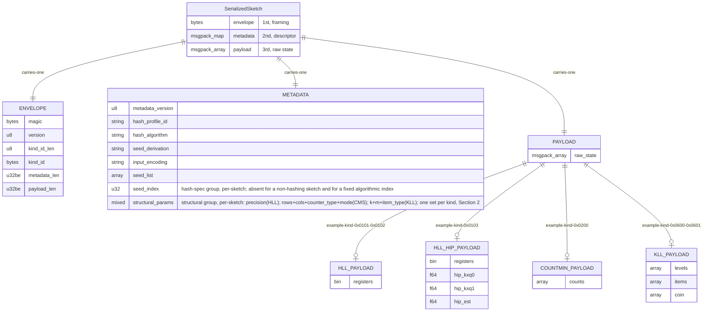

# ASAPv1 Wire Format: Design Doc

## What this is

ASAPv1 is ProjectASAP's self-describing binary format to serialize sketches in `asap_sketchlib`.
It fixes the exact bytes written when a sketch (HyperLogLog, Count-Min, and so on) is saved or shipped, so any process or language (Rust today, Go next) can decode it, confirm it was hashed compatibly, and merge or query it.
This doc describes that byte layout at a high level; the byte-exact encoding rules live in Section 4, and the implementation notes (decoder validation, converting an in-memory sketch) live in Section 5.

## Which parts to read

If the doc feels long, these sections carry the key points:

- [**Section 1, Envelope**](#section-1-envelope): the Layout table.
- [**Section 2, Metadata**](#section-2-metadata): the fields table, the hash-spec table, the structural-params table.
- [**Section 3, Payload**](#section-3-payload): one subsection per kind_id, in registry order. The HLL, Count-Min and KLL payloads are the smallest worked examples.

## Terms

- **Envelope**: the header that wraps the metadata and payload (`magic | version | kind_id | length-prefixes`). Sketch-agnostic framing; it is not the whole binary.
- **Metadata**: the descriptor (msgpack map) holding the hash spec (how the sketch was hashed) plus the structural params needed to read the payload.
- **Payload**: the sketch's raw state (registers, counters, and so on), a positional msgpack array. The per-sketch-authored part.
- **kind / kind_id**: an id naming the algorithm (e.g. `0x02 0x00` = Count-Min); 2 bytes today, extendable to more since `kind_id_len` is a byte. The registry maps id to name to payload shape.
- **Hash profile**: the identified set of hash constants (algorithm, seeds, seed indices) a sketch was built with, carried in the metadata so the bytes are truthful (`HashProfile` trait in Rust).
- **seed_list**: the array of hash seeds, carried inline in every sketch's metadata so the bytes self-describe the hash with no registry lookup.
- **wire-eligible**: a sketch config the format can serialize. The wire covers a fixed subset of the freer in-memory types; a config outside that subset is converted to a covered one first (Section 3.2, Section 5).

## Status

- **Implemented (Rust).** Every kind_id the Section 1 registry marks *implemented* serializes through the shared `message_pack_format::envelope` module per this spec: HLL (three estimators), Count-Min, CMSHeap, Count Sketch, CSHeap, DDSketch, KLL (compact + dynamic), Hydra (five counter variants), Elastic, Coco, UniformSampling, KMV, UnivMon, UnivMon Optimized, ExponentialHistogram, EHSketchList, Bloom, Space-Saving, CountL2HH and UnivMon-Q.
- **Self-describing.** The hash-spec metadata is derived from the hasher's `HashProfile` (read live, never hardcoded), so the bytes truthfully describe how a sketch was hashed; custom hash profiles are supported (Section 2).
- **Byte-level encoding** is pinned in Section 4; the resolved decisions are summarized at the end.
- **`sketchlib-go`** is aligned separately (see Cross-language contract).

## Layering

| Layer | Scope | Self-describing? | Owner | Changes when |
| ------- | ------- | ------------------ | ------- | -------------- |
| **Envelope** | frame | yes | one shared module | the framing changes (rare) |
| **Metadata** | descriptor (hash spec + structural params) | yes | one shared module | the hash profile or a sketch's params change |
| **Payload** | one per sketch | **no** | each sketch | that sketch's raw encoding changes |

Every serialized sketch carries its own envelope, metadata, and payload.
What differs is **who authors each part**: the envelope framing and the metadata schema are shared and sketch-agnostic (one module, identical across all sketches), while the payload layout is defined per sketch.
Values still vary per sketch: each blob carries its own precision, rows/cols, register bytes, and so on.

```text
+-------------------------------+
| Envelope | Metadata | Payload |
+-------------------------------+
```

### Guiding principle

In the byte stream, `kind_id` and `metadata` come **before** the `payload`.
By the time the decoder reaches the payload it already knows both, and together they fix the payload's structure completely.
So the payload carries **raw state only**: no field names, no tag that `kind_id` or the metadata already carries, no derived quantities.
If a payload looks complicated, either the sketch genuinely has that much state, or something derivable/redundant leaked in and should be removed.

### Structure

A serialized sketch is one envelope, then one metadata, then one payload.

The diagram fixes the framing, which every kind shares. Its four `PAYLOAD` branches are **four examples, not the whole set**: Section 3 carries one subsection per kind_id, and the Section 1 registry is the complete list.


```mermaid
erDiagram
    SerializedSketch {
        bytes envelope "1st, framing"
        msgpack_map metadata "2nd, descriptor"
        msgpack_array payload "3rd, raw state"
    }
    SerializedSketch ||--|| ENVELOPE : carries-one
    SerializedSketch ||--|| METADATA : carries-one
    SerializedSketch ||--|| PAYLOAD : carries-one
    PAYLOAD ||--o| HLL_PAYLOAD : example-kind-0x0101-0x0102
    PAYLOAD ||--o| HLL_HIP_PAYLOAD : example-kind-0x0103
    PAYLOAD ||--o| COUNTMIN_PAYLOAD : example-kind-0x0200
    PAYLOAD ||--o| KLL_PAYLOAD : example-kind-0x0600-0x0601
    ENVELOPE {
        bytes magic
        u8 version
        u8 kind_id_len
        bytes kind_id
        u32be metadata_len
        u32be payload_len
    }
    METADATA {
        u8 metadata_version
        string hash_profile_id
        string hash_algorithm
        string seed_derivation
        string input_encoding
        array seed_list
        u32 seed_index "hash-spec group, per-sketch; absent for a non-hashing sketch and for a fixed algorithmic index"
        mixed structural_params "structural group, per-sketch: precision(HLL); rows+cols+counter_type+mode(CMS); k+m+item_type(KLL); one set per kind, Section 2"
    }
    PAYLOAD {
        msgpack_array raw_state
    }
    HLL_PAYLOAD {
        bin registers
    }
    HLL_HIP_PAYLOAD {
        bin registers
        f64 hip_kxq0
        f64 hip_kxq1
        f64 hip_est
    }
    COUNTMIN_PAYLOAD {
        array counts
    }
    KLL_PAYLOAD {
        array levels
        array items
        array coin
    }
```

---

## Section 1: Envelope

A flat, sketch-agnostic frame.
It answers, with zero knowledge of the sketch: *is this ours?* (magic), *how do I parse the frame?* (version), *what algorithm?* (kind_id).
The envelope is essentially **constant** across sketches; only `kind_id` and the two length fields differ.

### Layout

```md
[ magic:6 | version:u8 | kind_id_len:u8 | kind_id:bytes
          | metadata_len:u32_be | payload_len:u32_be
          | metadata:msgpack | payload:msgpack ]
```

| Field | Type | Value / range | Notes |
| ------- | ------ | --------------- | ------- |
| `magic` | 6 bytes | `41 53 41 50 76 31` = `b"ASAPv1"` | fixed sentinel |
| `version` | u8 | `0x01` | envelope layout version; this doc = `0x01` |
| `kind_id_len` | u8 | `2` today (<=255) | length of `kind_id` |
| `kind_id` | bytes | see registry | which algorithm |
| `metadata_len` | u32 be | varies | byte length of the metadata block |
| `payload_len` | u32 be | varies | byte length of the payload |
| `metadata` | msgpack map | varies | Section 2 |
| `payload` | msgpack array | varies | Section 3 |

**`payload_len`** makes the envelope a self-delimiting record (needed to ever place a sketch inside a larger container).
`metadata_len` is variable only because the metadata is a variable-length msgpack map (Section 2); the length fields are pure framing and do not depend on the sketch.

### The `kind_id` scheme

#### Design choice: `kind_id` refers to **algorithm level**

Count-Min is **one** kind_id: its counter type (i64/f64) and mode (fast/regular) live in the metadata, so the id stays the same across them.
Classic and Ertl-MLE have byte-identical payloads but are separate ids because `kind_id` also selects the *estimator* to apply.

#### Design choice: a numeric `kind_id` (string form left open)

The wire carries the compact `kind_id` and resolves the algorithm name through the registry below; it does not encode a raw string like `"HyperLogLog-Classic"`.
The registry is the single place that maps id to name; the door is left open to switch to a string scheme later if it ever earns its keep.

#### `kind_id` structure

Today `kind_id` is `[family, variant]` and names the sketch's **algorithm** (its parameters live in the metadata):

- **family** (byte 1) picks the sketch type: `0x01` = HLL, `0x02` = Count-Min, and so on.
- **variant** (byte 2) picks the algorithm within that family; for HLL, Classic vs Ertl-MLE vs HIP.

**Allocation rules:**

- `kind_id` is **variable-length** (`kind_id_len` is a u8), so the id space is effectively unbounded; it can keep growing forever, and we will never run out.
- A `kind_id` is **allocated once and never recycled.** When an algorithm is retired, its id stays reserved permanently; reusing a retired number would make a new decoder silently misread old bytes.
- A **new incompatible payload encoding gets a new `kind_id`** (Q-VER: versioning lives in the id, which keeps payloads minimal; the payload has no version field of its own).

### kind_id registry (single source of truth, mirrored verbatim in `sketchlib-go`)

The **family** bytes match `sketchlib-go`'s `wire/asapmsgpack/magic_ids.go` verbatim; `0x0a`+ are new allocations for sketches in [`apis.md`](./apis.md) that Go has not assigned yet.
Rows marked *implemented* have designed payloads; every other row is a reservation with payload **TBD**.

A family carries one variant sub-id per algorithm being built under it — HLL's estimators, KLL's two forms, Hydra's counter types — and the rest of each family's variant range stays reserved until a concrete combination is taken up.

This registry is the master list of algorithms still to design payloads for, and of the ids no algorithm may take.

| kind_id | Sketch | Algorithm / variant | Payload | Status |
| --------- | -------- | --------- | --------- | -------- |
| `0x01 0x00` | HLL | Unspecified | - | reserved |
| `0x01 0x01` | HLL | Classic ("Regular") | Section 3.1 | implemented |
| `0x01 0x02` | HLL | Ertl-MLE ("Datafusion") | Section 3.1 | implemented |
| `0x01 0x03` | HLL | HIP | Section 3.1 | implemented |
| `0x02 0x00` | Count-Min | Count-Min | Section 3.2 | implemented |
| `0x03 0x00` | Count-Min-with-heap (CMSHeap) | Count-Min + top-k heap | Section 3.7 | implemented |
| `0x04 0x00` | Count Sketch | Count Sketch | Section 3.6 | implemented |
| `0x05 0x00` | DDSketch | Logarithmic bucket store | Section 3.8 | implemented |
| `0x06 0x00` | KLL | Compact | Section 3.3 | implemented |
| `0x06 0x01` | KLL dynamic | Dynamic | Section 3.3 | implemented |
| `0x07 0x00` | Hydra | KLL counter | Section 3.9 | implemented |
| `0x07 0x01` | Hydra | Count-Min counter | Section 3.9 | implemented |
| `0x07 0x02` | Hydra | Count Sketch counter | Section 3.9 | implemented |
| `0x07 0x03` | Hydra | HyperLogLog counter | Section 3.9 | implemented |
| `0x07 0x04` | Hydra | UnivMon counter | Section 3.9 | implemented |
| `0x08 0x00` | SetAggregator | - | TBD | assigned in Go / payload not designed |
| `0x09 0x00` | DeltaResult | - | TBD | assigned in Go / payload not designed |
| `0x0a 0x00` | Count-Sketch-with-heap (CSHeap) | Count Sketch + top-k heap | Section 3.10 | implemented |
| `0x0b 0x00` | Elastic | Heavy/light | Section 3.11 | implemented |
| `0x0c 0x00` | Coco | CocoSketch | Section 3.12 | implemented |
| `0x0d 0x00` | UniformSampling (`Unstable`) | Priority sampling | Section 3.13 | implemented |
| `0x0e 0x00` | KMV (`Unstable`) | k-minimum-values | Section 3.14 | implemented |
| `0x0f 0x00` | HashSketchEnsemble | - | TBD | reserved / not designed |
| `0x10 0x00` | UnivMon | Pyramid | Section 3.15 | implemented |
| `0x11 0x00` | UnivMon Optimized | Two-tier pyramid | Section 3.16 | implemented |
| `0x12 0x00` | NitroBatch | - | TBD | reserved / not designed |
| `0x13 0x00` | ExponentialHistogram | Sliding window over sketch buckets | Section 3.17 | implemented |
| `0x14 0x00` | EHSketchList | Nested-sketch union | Section 3.18 | implemented |
| `0x15 0x00` | EHUnivOptimized (`Unstable`) | - | TBD | reserved / not designed |
| `0x16 0x00` | OctoSketch | - | TBD | reserved / not designed |
| `0x17 0x00` | Bloom | Partitioned | Section 3.4 | implemented |
| `0x18 0x00` | Space-Saving | Stream-Summary | Section 3.5 | implemented |
| `0x19 0x00` | CountL2HH | Count Sketch with L2 accumulators | Section 3.19 | implemented |
| `0x1a 0x00` | UnivMon-Q (`UnivMonQ`) | Quantile pyramid | Section 3.20 | implemented |
| `0x1b 0x00` | FoldCMS | - | TBD | reserved / not designed |
| `0x1c 0x00` | FoldCS | - | TBD | reserved / not designed |
| `0x1d 0x00` | - | - | TBD | retired / permanently reserved, never reassign |

**Mapping notes** (mismatches between `apis.md` and Go's `magic_ids.go`):

- **CMSHeap vs CSHeap.** Go's `MagicCountMinSketchWithHeap` (`0x03`) is the Count-*Min*-with-heap sketch (`apis.md` to CMSHeap). The Count-*Sketch*-with-heap sketch (`apis.md` to CSHeap) is a distinct family and gets a fresh byte (`0x0a`), separate from `0x03`.
- **Hydra.** `apis.md` lists the "Hydra" framework; Go's only Hydra id is `MagicHydraKLLSketch` (`0x07`), so Hydra maps here to the `0x07` family. Each base sketch under Hydra has its own variant: `0x07 0x00` KLL, `0x07 0x01` Count-Min, `0x07 0x02` Count Sketch, `0x07 0x03` HyperLogLog, `0x07 0x04` UnivMon. `0x07 0x05`-`0x07 0xff` are **reserved for Hydra over further base sketches**; a concrete variant is allocated when that combination's payload is designed.
- **SetAggregator / DeltaResult** (`0x08` / `0x09`) come from Go's `magic_ids.go` and do not appear as sketches in `apis.md` (they are aggregation and delta-result envelopes, distinct from stand-alone sketches). They are kept here so the family space stays mirrored verbatim with Go.
- **`0x19`-`0x1c`.** CountL2HH, UnivMon-Q, FoldCMS and FoldCS have no counterpart in Go's `magic_ids.go`; their family bytes are allocated here first, and Go mirrors them from this registry.
- **`Unstable`** rows mirror the `Unstable` status those sketches carry in `apis.md`. The kind_id is permanent either way; the payload and the sketch API may still change, and a change to the payload takes a new id (Q-VER).

### Decoder rules

1. `len >= 6+1+1+0+4+4` before reading anything.
2. `magic` matches, else reject.
3. `version` is known, else reject (no best-effort parse).
4. Read `kind_id`; the per-sketch decoder rejects any `kind_id` it does not own.
5. Read `metadata`; validate it against the target type's profile (Section 5, Validation).
6. Cross-check metadata against `kind_id` and the payload, so structural params stay consistent (Section 5, Validation).
7. Read exactly `payload_len` bytes; hand to the per-sketch payload decoder.
8. Fail **closed** on any inconsistency; never merge or query a sketch whose hash spec did not validate.

> Implementation note: the shared envelope module (`src/message_pack_format/envelope.rs`) owns rules 1-3 and the byte framing (`encode` / `split`); it is sketch-agnostic and does not know the registry.
> Rule 4 (and metadata/kind_id validation) happens in each sketch's decoder, which checks the `kind_id` against the ones it owns.

---

## Section 2: Metadata

The **descriptor**: the configuration of a sketch algorithm.
Two groups of fields:

- **Hash spec**: how keys were hashed (so two sketches can be checked mergeable and a query key hashed the same way). Profile-derived.
- **Structural params**: parameters that shape the payload (HLL precision, CMS counter type, CMS mode). Per-sketch, per-algorithm.

**Simple rule:** anything you configure when creating a sketch goes in the metadata.

### Encoding: msgpack **map** keyed by field name

- Metadata is a **msgpack map**, so a consumer reads fields by name (`"hash_profile_id"`) with no positional guesswork.
- The schema is fixed and closed: **each sketch has its own fixed metadata schema** (in Rust, one struct per sketch with `#[serde(deny_unknown_fields)]`).
- The field *set* differs per sketch: HLL carries `precision` + `canonical_seed_index`; Count-Min carries `rows`, `cols`, `counter_type`, `mode` + `matrix_seed_index`.
- Within a given sketch **every field is required**: a missing key, or an unexpected extra key, is **rejected (fail closed)**, never silently defaulted or skipped.
- **`seed_list` is inlined**, so the bytes self-describe the hash; a consumer reads the exact seeds straight from the binary, with no registry. (It costs ~130 bytes; resolving seeds from `hash_profile_id` via a registry is a v2 space optimization.)

### Fields

The metadata map is **two groups** of fields, written on the wire in this order: Hash spec first, then Structural params.

| Group | Role | Fields |
| ----- | ---- | ------ |
| **Hash spec** | how keys were hashed (check mergeability + re-hash a query key) | `metadata_version`, `hash_profile_id`, `hash_algorithm`, `seed_derivation`, `input_encoding`, `seed_list`, + the seed index(es) it uses |
| **Structural params** | parameters that shape the payload | one fixed set per kind: `precision` (HLL); `rows`, `cols`, `counter_type`, `mode` (Count-Min); `k`, `m`, `item_type`, optional `seed` (KLL); and so on through the registry |

The two tables below are the field-by-field detail of each group.

> **Non-hashing sketches omit the hash-spec group entirely** (Q-KLL). The hash spec answers "how were keys hashed"; a sketch that does not hash its inputs has no truthful answer. KLL is comparison-based — it orders raw numeric values with `total_cmp` and never invokes a hasher — so its metadata carries **only** structural params (`metadata_version`, `k`, `m`, `item_type`, and an optional `seed`). This keeps the bytes honest (no meaningless `seed_list`) and is the reason KLL's metadata schema is not built from a `HashProfile` the way HLL's / Count-Min's are. Note `seed` is unrelated to the hash `seed_list`: it is the KLL compaction RNG's reproducible seed, and it is the **only optional key** in v1 (present only when the sketch was built with one; the key is omitted otherwise, and `KLLDynamic` never emits it). A consumer that does not use it (including Go) MUST still preserve it verbatim on re-encode so the bytes round-trip identically.

**Hash spec**

| Key | Type | Required | Meaning |
| ------- | ------ | -------- | --------- |
| `metadata_version` | u8 | yes | schema version of *this block* (`1`). Independent of envelope `version`. |
| `hash_profile_id` | string | yes | stable global id `"projectasap.xxh3.seedlist.v1"`; authoritative |
| `hash_algorithm` | string | yes | `"xxh3_64_128"` |
| `seed_derivation` | string | yes | `"seed_list_index_wrap"` |
| `input_encoding` | string | yes | `"projectasap.input.v1"` |
| `seed_list` | `array<u64>` | **yes (inlined)** | the 20 seeds, carried inline so the bytes self-describe the hash |
| `canonical_seed_index` | u32 | **per-sketch** | index into `seed_list` (`5`); HLL, KMV and Hydra's HLL counter use it |
| `matrix_seed_index` | u32 | **per-sketch** | `0`; Count-Min, Count Sketch, CMSHeap, CSHeap, Elastic and Hydra's matrix counters use it |

These two are the only seed-index keys, because `HashProfile` declares exactly two seed-index constants — `CANONICAL_SEED_INDEX` and `MATRIX_SEED_INDEX` — and a sketch's key is derived from one of them.

**A sketch carries a seed-index key only for a hash whose index it reads off the profile.** An index fixed by the algorithm gets no key: Space-Saving hashes at `0`, Coco hashes array `i` at index `i`, Elastic's heavy table hashes at the canonical index, Hydra fans a record out at `HYDRA_SEED`, and the UnivMon family finds a bottom layer at `BOTTOM_LAYER_FINDER`. No key would describe those truthfully, and a field that can be wrong is worse than none. A sketch that mixes the two carries a key for the profile-derived hash alone: Elastic carries `matrix_seed_index` for its inlined light Count-Min and nothing for its heavy table.

**Structural params**

| Key | Type | Applies to | Meaning |
| ------- | ------ | -------- | --------- |
| `precision` | u8 | HLL | `12` / `14` / `16`; register count = `2^precision` |
| `rows` | u32 | Count-Min, Count Sketch, CMSHeap, CSHeap, Bloom, Coco, CountL2HH, Hydra | matrix depth; for Bloom the number of slices; for Coco the arrays an insert scans; for Hydra the grid depth |
| `cols` | u32 | Count-Min, Count Sketch, CMSHeap, CSHeap, Bloom, Coco, CountL2HH, Hydra | matrix width; for Bloom the bits per slice; for Coco the buckets per array; for Hydra the grid width |
| `counter_type` | string | Count-Min, CMSHeap | `"i32"`, `"i64"` or `"f64"`; element type of `counts`, never widened |
| `counter_type` | string | Count Sketch, CSHeap, UnivMon-Q | `"i32"` or `"i64"`; signed cells, never widened |
| `mode` | string | Count-Min, Count Sketch, CMSHeap, CSHeap, Bloom | `"fast"` or `"regular"`; key-to-column derivation |
| `k` | u32 | KLL | compactor capacity (accuracy parameter) |
| `k` | u32 | CMSHeap, CSHeap, KMV, ExponentialHistogram | a retention bound: the heap capacity, the digests kept, or the histogram's merge parameter |
| `m` | u32 | KLL | minimum level capacity |
| `item_type` | string | KLL | `"f64"` or `"i64"`; element type of `items` |
| `item_type` | string | UniformSampling | `"f64"`; element type of `values` |
| `capacity` | u32 | Space-Saving | monitored-counter budget |
| `key_type` | string | Space-Saving, CMSHeap, CSHeap, UnivMon, UnivMon Optimized | exact `HeapItem` variant of `keys`, never widened (Section 3.5) |
| `seed_index` | u32 | CountL2HH, UnivMon-Q | a per-instance seed offset the caller chose; a structural param, not a profile constant |
| `alpha` | f64 | DDSketch | relative accuracy, in `(0, 1)`; every bucket index derives from it |
| `sample_rate` | f64 | UniformSampling | the construction rate, in `(0, 1]` |
| `schema` | array | Hydra | the key-column labels; the escaped forms are rebuilt from them |
| `window` | u64 | ExponentialHistogram | the sliding window's span |
| `seed` | u64 | KLL | **optional**; the reproducible compaction seed, present only when the sketch carries one, else the key is omitted. Compact KLL only (`KLLDynamic` never emits it). The one optional key in v1. |

The names above are the ones more than one kind shares. **Each kind's full structural-param set, in its canonical wire order, is in that kind's Section 3 subsection** — including the prefixed forms a kind gives an inlined sub-sketch's params (Elastic's `heavy_buckets` / `light_rows` / `light_cols` / `light_counter_type` / `light_mode`, Hydra's `counter_*`, the UnivMon family's `layer_size` / tier widths / `heap_size`, UnivMon-Q's config).

Count-Min's matrix dimensions are **configuration** (they shape the payload, like HLL's `precision`), so per the config-to-metadata rule they live here.
Count-Min's canonical structural-param order is `... matrix_seed_index, rows, cols, counter_type, mode`; this is the wire contract and Go must mirror it verbatim.

### Standard ProjectASAP profile (reference values)

The hash-spec field *values* are read live from the hasher's `HashProfile`: `hll_metadata::<H>` / `cms_metadata::<H>` read `PROFILE_ID`, `ALGORITHM`, `SEED_DERIVATION`, `INPUT_ENCODING`, `seed_list()`, and the seed index straight off `H`.
The block below is the **standard profile**, the one `DefaultXxHasher` declares (the single source of truth for these values); it is also what the registry resolves `hash_profile_id` to.
A single sketch's metadata carries `hash_profile_id` plus only the subset of indices/params it uses.

```md
metadata_version = 1
hash_profile_id  = "projectasap.xxh3.seedlist.v1"
hash_algorithm   = "xxh3_64_128"
seed_list        = [0xcafe3553, 0xade3415118, 0x8cc70208, 0x2f024b2b, 0x451a3df5,
                    0x6a09e667, 0xbb67ae85, 0x3c6ef372, 0xa54ff53a, 0x510e527f,
                    0x9b05688c, 0x1f83d9ab, 0x5be0cd19, 0xcbbb9d5d, 0x629a292a,
                    0x9159015a, 0x152fecd8, 0x67332667, 0x8eb44a87, 0xdb0c2e0d]
canonical_seed_index            = 5
matrix_seed_index               = 0
seed_derivation  = "seed_list_index_wrap"
input_encoding   = "projectasap.input.v1"
```

The seed list also holds the two indices the algorithms fix for themselves — `HYDRA_SEED` at `6` and `BOTTOM_LAYER_FINDER` at `19`. Neither is a `HashProfile` constant and neither reaches the metadata as a key: a sketch hashing at a fixed index carries no seed-index key at all (see above).

### Custom hash profiles

Because the metadata is `HashProfile`-derived, a hasher that declares its own profile (a different `PROFILE_ID` / `seed_list()` / seed index) serializes **truthfully**; its own values land in the metadata.
Since `seed_list` is inlined, those bytes are **fully self-describing**: a consumer reads the exact seeds and algorithm straight from the binary, with no registry, even for a hash it has never seen.
This is safe on both ends because serialization **fails closed**:

- **Encode side (compile-time).** `serialize_to_bytes` is bounded on `H: HashProfile`, so a hasher that does *not* declare a profile simply cannot serialize; mislabeled bytes are impossible by construction.
- **Decode side (runtime).** Decode validates the metadata against the *target* type's `HashProfile`, so bytes hashed under profile A cannot be decoded into a profile-B-typed sketch; they are rejected (see Section 5, Validation).
- **Merge.** Merge compatibility is hash-spec equality (same `hash_profile_id` + seeds). A custom-profile sketch is not mergeable with a standard-profile one.

---

## Section 3: Payload

Per sketch. **Raw state only**, a **positional msgpack array** in the order its kind_id implies. Rules:

- No field that `kind_id` or the metadata already determines (no variant tag, no precision, no counter type, no mode).
- No field derivable from another (no HLL `precision`; no CMS `l1`/`l2`, which are `sum(count)` / `sum(count^2)` and are recomputed on decode).
- msgpack array (positional), never a keyed map. The exact msgpack types are in "Wire encoding rules".

> Note: derived summaries like CMS `l1`/`l2` and `sum_counts`/`sum2_counts` live in the **delta / error-accounting** format (proto `CountMinState`), a separate wire format.
> They do not belong in the self-contained sketch payload.

### 3.1: HLL payload (`0x01 0x01` / `0x01 0x02` / `0x01 0x03`)

The variant is in `kind_id`, precision is in the metadata (and equals `log2(register count)`), so the only real state is the register bytes (plus three running scalars for HIP).

**Classic / Ertl-MLE** (`0x01 0x01`, `0x01 0x02`), identical layout:

| Pos | Field | Type | Notes |
| ----- | ------- | ------ | ------- |
| 0 | `registers` | bin | one byte per register; length is `2^precision` |

**HIP** (`0x01 0x03`):

| Pos | Field | Type | Notes |
| ----- | ------- | ------ | ------- |
| 0 | `registers` | bin | one byte per register |
| 1 | `hip_kxq0` | f64 | HIP running estimate state |
| 2 | `hip_kxq1` | f64 | |
| 3 | `hip_est` | f64 | |

### 3.2: Count-Min payload (`0x02 0x00`)

The `CountMin` struct is generic in memory (counter `i32`/`i64`/`i128`/`f64`, `RegularPath`/`FastPath`, Nitro, and so on).
**That freedom is kept in memory; nothing is forbidden.**
The wire supports a fixed set. The two parameters that shape it, **counter type** (`"i32"`/`"i64"`/`"f64"`) and **mode** (`"fast"`/`"regular"`), live in the metadata, so the payload itself is just shape and counters:

| Pos | Field | Type | Notes |
| ----- | ------- | ------ | ------- |
| 0 | `counts` | array | packed **row-major**, `rows*cols` cells; element type = `counter_type` |

`rows` and `cols` live in the metadata as structural params (Section 2), so the payload omits them.
The payload is a **1-element positional array `[counts]`**, mirroring HLL Classic's `[registers]`.

Wire counter types are `"i32"`, `"i64"` and `"f64"` (`i128` and exotic counters are not wire types). `i32` is carried at its own width, not widened, and the decoder pins it: `i32` bytes do not decode into an `i64` sketch, or the reverse.
`mode` records `RegularPath` vs `FastPath` because they place a key in different columns (compare `cm_regular_path_correctness` vs `cm_fast_path_correctness`), so a reader must know which to reproduce a query.
A counter type other than i32/i64/f64, or non-`Vector2D` storage, must be converted first; see Section 5, "Converting an exotic in-memory sketch".
Both modes, `FastPath` and `RegularPath`, serialize directly (you'd only "convert" a mode to *change* it, which needs re-inserting the data).

### 3.3: KLL payload (`0x06 0x00` compact / `0x06 0x01` dynamic)

Both KLL variants (the compact fixed-buffer `KLL` and the growable `KLLDynamic`) share **one payload shape**; they differ only by `kind_id` (like HLL's Classic vs Ertl-MLE), because their in-memory buffers differ but the serialized quantile state is the same. The accuracy params `k` / `m`, the `item_type`, and the optional `seed` live in the metadata (§2), so the payload is just the retained state:

| Pos | Field | Type | Notes |
| ----- | ------- | ------ | ------- |
| 0 | `levels` | array | level boundary indices, length `num_levels + 1`; `levels[0] == 0`, `levels[last] == len(items)` |
| 1 | `items` | array | retained samples in level order; element type = `item_type` |
| 2 | `coin` | array | compaction RNG state `[state:u64, bit_cache:u64, remaining_bits:u32]` |

`num_levels` is `levels.len() - 1` (derived, so not stored). The `coin` is the randomized-compaction RNG; it is carried so a decoded sketch can keep compacting deterministically (a query-only consumer may ignore it). It is a nested 3-element array mirroring `sketchlib-go`'s `CoinState`.

**Item order (cross-language contract).** `levels` / `items` use the **top-most-level-first** layout, byte-for-byte matching `sketchlib-go`'s `KLLState`: index `i` in `levels` maps to compactor level `num_levels - 1 - i`, and level 0's run is in **input order**. The compact `KLL` grows its buffer leftward and stores level 0 reverse-input, so its encoder reverses level 0 back to input order (and its decoder reverses it in); `KLLDynamic` already stores this layout natively. Within a level, order past the first compaction is not guaranteed byte-identical across the two Rust variants (or across languages), but the retained set and quantiles agree — see the caveat on `KLL::wire_items`.

### 3.4: Bloom payload (`0x17 0x00`)

`Bloom` is the *partitioned* filter: `rows` slices of `cols` bits over the same `rows x cols` grid Count-Min probes, one bit set per slice.
Its structural parameters — the grid dimensions (`rows` / `cols`) and the column-derivation **mode** (`"fast"` / `"regular"`) — live in the metadata exactly as Count-Min's do, so the payload is the packed bits plus the one counter nothing else determines:

| Pos | Field | Type | Notes |
| ----- | ------- | ------ | ------- |
| 0 | `words` | array | the bit grid packed into `u64`s, **row-major**; each row padded out to whole words, so the stride is `ceil(cols / 64)` and the length is `rows * ceil(cols / 64)` |
| 1 | `inserted` | u64 | `insert` calls the filter has seen, duplicates included |

`rows` and `cols` are metadata structural params (Section 2), so the payload omits them and the decoder derives the word stride from `cols`.
`mode` records `RegularPath` vs `FastPath` for the same reason Count-Min does: the two paths fold a key into different columns on most geometries, so a filter read back on the wrong path answers no about its own members.
`inserted` is **not** derivable from `words` — re-inserting a key sets no new bit — so it is carried. Everything else the filter reports is: `fill_ratio`, `estimated_fpp` and `predicted_fpp` are all recomputed from the bits and the dimensions, and none of them appear.

**Wire-eligible geometries.** The wire covers what `Bloom::with_capacity` produces: `1 <= rows <= 20` (`BLOOM_MAX_SLICES`, the seed list length), a **power-of-two** `cols`, and `rows * cols <= 2^31` (`BLOOM_MAX_BITS`).
`Bloom::with_dimensions` is free to build a filter outside that subset — more rows than there are seeds (which duplicate an earlier slice bit for bit), or a modulo-folded width — and such a filter is rejected on **both** sides, so the format never emits bytes it would refuse to read back.
This mirrors Count-Min, whose wire covers i32/i64/f64 counters while the in-memory type stays freer (Section 3.2, Section 5).

**Decode rules** (all fail closed, per Section 1's decoder rules):

1. `kind_id` is `0x17 0x00`; any other id is rejected.
2. The metadata's hash spec and `mode` must equal the target type's own, with `rows` / `cols` echoed back since those are structural and the filter is sized from them. Cross-profile and cross-mode bytes are rejected.
3. `rows` and `cols` are both non-zero, `cols` is a power of two, `rows <= 20`, and `rows * cols` neither overflows nor exceeds `2^31`. Checked **before** anything is sized from the declared dimensions, so a hostile geometry never reaches an allocation.
4. `len(words) == rows * ceil(cols / 64)` exactly, and that product must not overflow.
5. No bit may be set in a row's **trailing padding**, positions `cols .. 64*ceil(cols/64)`. A query cannot reach those bits, but `count_ones` sums them, so a crafted payload could skew every rate the filter reports — `fill_ratio`, `estimated_fpp`, `is_empty` — while every membership answer still looked normal. No encoder can produce them, so the rule never rejects real bytes, and it makes the decoded form canonical: a round trip re-serializes byte-identically.

### 3.5: Space-Saving payload (`0x18 0x00`)

`SpaceSaving` monitors a fixed number of keys in a Stream-Summary: a doubly linked list of count buckets, a counter arena, and a key index into it.
**None of that structure reaches the wire.** Every link and index is derivable from the `(key, count, error)` triples the summary answers with, so the payload carries the triples plus the two running scalars and the decoder rebuilds the arenas. The structure is also the reason to do it this way: with no arena index on the wire, no crafted payload can point one out of bounds or into a cycle.

The counter budget `capacity` and the `key_type` are configuration and live in the metadata (Section 2), so the payload is:

| Pos | Field | Type | Notes |
| ----- | ------- | ------ | ------- |
| 0 | `keys` | array | one monitored key per counter; element type = `key_type`; homogeneous |
| 1 | `counts` | array | u64 recorded count, parallel to `keys` |
| 2 | `errors` | array | u64 error allowance, parallel to `keys`; `errors[i] <= counts[i]` |
| 3 | `total` | u64 | total weight recorded, monitored or displaced |
| 4 | `floor` | u64 | the largest count known to have left the summary |

The three arrays are parallel and equal-length; the number of monitored keys is `len(keys)` (derived, so not stored).
`min_count` is **not** stored either: it is `max(floor, smallest count still held)` and is recomputed on load.

`floor`, by contrast, is **not** derivable from the triples — it records what an eviction or a merge dropped, and a merged summary can hold fewer keys than its capacity and still be missing keys the other side had already discarded. A payload carrying only the triples would decode such a summary with no ceiling at all, silently reporting `upper_bound == 0` for exactly the keys the ceiling exists to bound. So it is carried.

**Metadata vs payload.** `capacity` is the summary's one sizing parameter, chosen at construction, so per the config-to-metadata rule it belongs in the descriptor (like HLL's `precision` or Count-Min's `rows`/`cols`). `key_type` is a structural param in the Count-Min `counter_type` / KLL `item_type` sense: it fixes the element type of the payload's `keys` array, and the payload cannot be read without it.

Space-Saving carries the hash-spec group — it hashes, and a consumer must reproduce that hash to query a key — but carries **no seed-index key**. It hashes every key at seed index `0` unconditionally: that is a fixed part of the algorithm, not a profile choice, so neither `canonical_seed_index` nor `matrix_seed_index` would describe it truthfully, and a metadata field that can be wrong is worse than none.

**`key_type` names the exact key variant, and is never widened.**
Count-Min's counter type is a Rust type parameter, fixed at compile time. A Space-Saving key's type is a **runtime** property: keys are stored as `HeapItem`, a 16-variant enum, and one summary's keys are whatever the caller inserted. So one `key_type` names the exact variant present and `keys` is homogeneous in it:

| `key_type` | `HeapItem` variant | msgpack element type |
| ------- | ------- | ------- |
| `"i8"` / `"i16"` / `"i32"` / `"i64"` / `"isize"` | `I8` / `I16` / `I32` / `I64` / `ISIZE` | integer, family + width per Section 4 |
| `"u8"` / `"u16"` / `"u32"` / `"u64"` / `"usize"` | `U8` / `U16` / `U32` / `U64` / `USIZE` | integer, family + width per Section 4 |
| `"f32"` | `F32` | float32 (`0xca`) |
| `"f64"` | `F64` | float64 (`0xcb`) |
| `"string"` | `String` | `str` |

`"f32"` is the one place a float is *not* widened to float64: the key's variant is the identity, so narrowing or widening it would change which key it is. Section 4's "always float64" rule governs *counter* and *sample* values, which have no identity to preserve.

**Why a key is never widened (e.g. `i32` to `i64`).** A counter is a number, and its width is a storage choice. A Space-Saving key is an *identity*, and the variant is part of it. `HeapItem`'s equality against a query `DataInput` is variant-exact — `HeapItem::I64(5)` does **not** equal `DataInput::I32(5)`. The digest, however, is variant-blind: the whole signed family hashes its value widened to `u64`, so a widened key lands in the **same index slot** and then fails the equality check. The result is not an error; it is `estimate` returning `0` for a key the summary is holding, with nothing anywhere to indicate a problem. So the wire records the variant exactly and the decoder rebuilds it exactly.

Two summaries have no encoding and **fail to serialize** rather than being coerced:

- **Mixed variants.** A summary whose monitored keys are of different `HeapItem` variants has no single `key_type`. Coercing them to a common type would silently break the keys that were coerced (above), so the encode fails with an error naming the mismatch.
- **128-bit keys.** `HeapItem::I128` / `U128` have no msgpack integer form (msgpack integers stop at 64 bits), so they are not wire types — the same line Count-Min draws at `i128` counters. Convert to a wire-eligible key type first; only the owner knows whether the mapping is lossless (Section 5).

**Empty summary.** A summary that monitors nothing has no variant to report. It emits `key_type = "u64"` with three empty arrays, so an empty summary has exactly one encoding rather than one per producer.

**Emitted order (cross-language contract).** The payload is **order-defined**: entries are written in **descending `count`**, ties broken by a **total order over the key** (variant tag first, then the value — the same order `merge_from` uses to break its own ties, so a merge and an encode agree). This is required, not cosmetic: `entries()` order follows the counter arena and `top_k` order follows the bucket walk, and neither survives a rebuild, so an unordered payload would re-serialize to different bytes than it decoded from. With the order pinned, two summaries holding the same triples emit the same bytes whatever order they were seated in, and re-serializing a decoded summary reproduces its bytes exactly.

**Decode rules.** Fail **closed** on each, with an error and never a panic:

1. `kind_id` is `0x18 0x00`.
2. The hash-spec group matches the **target hasher's** `HashProfile`. `capacity` and `key_type` are properties of the *stored* summary rather than of the target type, so they are echoed back into the expected metadata rather than pinned — the same treatment Count-Min gives `rows`/`cols`.
3. `key_type` is one of the thirteen names above; anything else is rejected. The `keys` array is then read **as** that type, so a payload whose keys are not of the declared type is rejected by the msgpack decode itself — string-keyed bytes relabelled `"u64"` do not decode as a `u64`-keyed summary.
4. `keys`, `counts` and `errors` have equal length.
5. `capacity >= 1`, and `len(keys) <= capacity`.
6. Every `counts[i] >= 1` (a counter at zero is not a state the algorithm reaches) and `errors[i] <= counts[i]`.
7. No key appears twice.
8. `capacity` **never sizes an allocation.** The counter arena and key index are sized from `len(keys)`, so a payload declaring `capacity = 2^32 - 1` with two counters costs two counters. A decoder must not preallocate from a declared size.

`min_count`, the bucket list, the counter arena and the key index are then recomputed from the validated triples; nothing about them is trusted from the wire.

### 3.6: Count Sketch payload (`0x04 0x00`)

Same shape as Count-Min (§3.2): the matrix dimensions (`rows` / `cols`), the **counter type** and the column-derivation **mode** (`"fast"`/`"regular"`) live in the metadata, so the payload is just the counters.

| Pos | Field | Type | Notes |
| ----- | ------- | ------ | ------- |
| 0 | `counts` | array | packed **row-major**, `rows*cols` cells; element type = `counter_type`, **signed** |

The payload is a **1-element positional array `[counts]`**.

Wire counter types are **`"i32"` and `"i64"`**. Count Sketch counters must be signed and negatable, so Count-Min's `f64` has no counterpart here, and `i128` has no msgpack integer form (the same line Count-Min draws). Non-`Vector2D` storage must be converted first; see Section 5, "Converting an exotic in-memory sketch".

**`i32` is carried at its own width, not widened to `i64`**, exactly as Count-Min's is (§3.2). The `Vector2D<i32>` variants of `HydraCounter` and `EHSketchList` are *nested* sketches, decoded back into the enum variant they were stored as, so the width is part of the identity; the decoder pins it, and `i32` bytes do not decode into an `i64` sketch, or the reverse.

Cells carry a sign: Count Sketch adds `±weight`, so a counter may be negative and a decoder must not assume monotonicity.

**Decode rules** (all fail closed, per Section 1's decoder rules):

1. `kind_id` is `0x04 0x00`; any other id is rejected.
2. The metadata's hash spec, `counter_type` and `mode` must equal the target type's own, with `rows` / `cols` echoed back since those are structural and the matrix is sized from them. `counter_type` is required: a map missing it does not decode, so it can never be silently defaulted.
3. `rows` and `cols` are both non-zero. Checked before the matrix is built: the column mask is derived from `cols.ilog2()`, which panics on `cols == 0`.
4. `len(counts) == rows * cols` exactly, checked **before** the allocation, so crafted dimensions cannot drive a huge reserve.

Rule 4 is enforced on the **encode** side too: a matrix whose cell count disagrees with its own dimensions (`Vector2D::init` reserves without filling) fails to serialize, so the format never emits bytes it would refuse to read back.

### 3.7: CMSHeap payload (`0x03 0x00`)

`CMSHeap` is a Count-Min sketch (§3.2) paired with an `HHHeap` of the keys it has seen most. The base sketch's counters are **inlined** rather than nested in an envelope of their own, so the payload is Count-Min's `counts` array followed by the heap's two parallel arrays:

| Pos | Field | Type | Notes |
| ----- | ------- | ------ | ------- |
| 0 | `counts` | array | the Count-Min matrix, packed **row-major**, `rows*cols` cells; element type = `counter_type` |
| 1 | `keys` | array | one key per heap entry; element type = `key_type`; homogeneous |
| 2 | `heap_counts` | array | i64 count, parallel to `keys` |

**The heap's index does not reach the wire.** `HHHeap` is a capacity-bounded min-heap beside a digest-to-position index; `slots` and `positions` are `#[serde(skip)]` in the type itself and are rebuilt from the entries on load, so the payload carries the entries only — the same argument §3.5 makes for Space-Saving's arenas, with the same benefit: with no index on the wire, no crafted payload can point one out of bounds or into a cycle. The entry count is `len(keys)` (derived, so not stored), and the heap's array order and its `is_full` state are recomputed.

**Metadata vs payload.** Everything the payload's structure depends on is configuration and lives in the metadata, in this canonical order (hash-spec group first, then structural params; Go must mirror it verbatim):

```md
metadata_version, hash_profile_id, hash_algorithm, seed_derivation, input_encoding,
seed_list, matrix_seed_index, rows, cols, counter_type, mode, k, key_type
```

`rows` / `cols` / `counter_type` / `mode` are exactly Count-Min's (§3.2, Q-CMS-DIMS), in exactly Count-Min's order; `k` and `key_type` are the heap's and follow them. `k` is the heap's one sizing parameter, chosen at construction (`HHHeap::new(k)`), so per the config-to-metadata rule it is a descriptor field, like `capacity` in §3.5. It is a `u32`; a heap whose `k` exceeds that fails the encode rather than emitting a capacity no decode would accept.

Wire counter types are the base Count-Min's: **`"i32"`, `"i64"` and `"f64"`**. `mode` records `RegularPath` vs `FastPath` because they place a key in different columns. A counter type outside that set, or non-`Vector2D` storage, must be converted first (Section 5).

**`key_type` names the exact key variant, and is never widened.** This is §3.5's rule, and the thirteen names and their `HeapItem` variants are the table there. A heap whose keys are of different variants has no single `key_type` and **fails to serialize** with an error naming the mismatch; `HeapItem::I128` / `U128` have no msgpack integer form and are not wire types. An empty heap has no variant to report: it emits `key_type = "u64"` with two empty arrays, so an empty heap has exactly one encoding rather than one per producer.

**Emitted order (cross-language contract).** `counts` is row-major. Heap entries are written in **descending `heap_counts`**, ties broken by a **total order over the key**: the variant tag first, in `HeapItem`'s declaration order, so every string sorts after every numeric key; then the value. This is required, not cosmetic: the heap's in-memory array order follows the sift path taken while it filled, and that order does not survive a rebuild, so an unordered payload would re-serialize to different bytes than it decoded from. With the order pinned, two heaps holding the same entries emit the same bytes whatever order they were seated in. Go must mirror the same comparator.

**Decode rules.** Fail **closed** on each, with an error and never a panic:

1. `kind_id` is `0x03 0x00`; any other id is rejected — including `0x02 0x00` (a plain Count-Min) and `0x0a 0x00` (a CSHeap), which carry a structurally identical metadata map.
2. The metadata's hash spec, `counter_type` and `mode` must equal the target type's own, with `rows` / `cols` / `k` / `key_type` echoed back since those are properties of the stored sketch rather than of the target. Every key is required: a map missing one, or carrying an unknown one, does not decode.
3. `rows` and `cols` are both non-zero, checked **before** the matrix is built: the column mask is derived from `cols.ilog2()`, which panics on `cols == 0`.
4. `key_type` is one of §3.5's thirteen names; anything else is rejected before the payload is read. The `keys` array is then read **as** that type, so string-keyed bytes relabelled `"u64"` do not decode.
5. `keys` and `heap_counts` have equal length.
6. `len(counts) == rows * cols` exactly, checked **before** the allocation, so crafted dimensions cannot drive a huge reserve.
7. `len(keys) <= k`, and no key appears twice.
8. `k` **never sizes an allocation.** Rule 7 is checked before the heap is built and the heap is then filled entry by entry, so a payload declaring `k = 2^32 - 1` with two entries costs two entries.

`slots`, `positions` and the heap array are recomputed from the validated entries; nothing about them is trusted from the wire. Rule 6 is enforced on the **encode** side too — a matrix whose cell count disagrees with its own dimensions (`Vector2D::init` reserves without filling) fails to serialize — as is the `k` bound, so the format never emits bytes it would refuse to read back.

### 3.8: DDSketch payload (`0x05 0x00`)

`DDSketch` maps a positive value to the logarithmic bucket index `floor(ln(v) / ln(gamma))` and keeps a dense count per bucket. The relative accuracy `alpha` is its one construction parameter and lives in the metadata, so the payload is the bucket store plus the running scalars the buckets do not determine:

| Pos | Field | Type | Notes |
| ----- | ------- | ------ | ------- |
| 0 | `counts` | array | dense per-bucket sample counts, u64; the bucket index of `counts[i]` is `offset + i`. Carried verbatim, growth padding included |
| 1 | `offset` | int | absolute bucket index of `counts[0]`; **signed**, since a value below `1.0` maps to a negative index. `0` when `counts` is empty |
| 2 | `sum` | f64 | exact sum of every ingested value; `0.0` when empty |
| 3 | `min` | f64 | smallest ingested value; `+inf` when empty |
| 4 | `max` | f64 | largest ingested value; `-inf` when empty |

**Metadata vs payload.** `alpha` shapes every bucket index and is chosen at construction, so per the config-to-metadata rule it is a structural param, like HLL's `precision`. `gamma`, `log_gamma` and `inv_log_gamma` are derived from it (`gamma = (1 + alpha) / (1 - alpha)`) and appear nowhere: the decoder re-derives them exactly as `DDSketch::new` does. The store's dimensions are not configuration — the store grows with the data — so there is no `rows`/`cols` analogue; `counts` is self-delimiting and `offset` positions it. The metadata is `metadata_version` then `alpha`.

**DDSketch carries no hash-spec group.** It never hashes: it maps a raw `f64` through a logarithm and carries no hasher type parameter at all. The hash spec answers "how were keys hashed", and a sketch that does not hash has no truthful answer, so the group is omitted entirely. This is the Q-KLL precedent, and the reason DDSketch's metadata schema is not `HashProfile`-derived the way HLL's and Count-Min's are.

**One positive-range store, no zero bucket.** `add` drops non-positive, non-finite and non-indexable values, so there is no negative-range store and no zero-count bucket to encode. Bucket *indices* are still signed, and `offset` carries that as a msgpack int per Section 4. The three payload floats are always float64.

**Emitted order (cross-language contract).** `counts` is the dense store in its own bucket-index order, ascending from `offset`, with the `GROW_CHUNK` padding zeros left in place and `offset` left where the sketch put it. Nothing is trimmed and nothing is sorted, so a decoded sketch re-serializes byte-identically and `store_counts()` / `store_offset()` mean the same thing on both sides.

**`count` is not carried.** Every path that advances `count` advances the bucket store by the same amount — `add` by one, `apply_delta` by the delta's value, `merge` by the other side's total — so the total sample count is exactly `sum(counts)` and is recomputed on decode. `sum`, `min` and `max` are *not* recoverable, since the buckets only bound them to within `alpha`, so all three are carried. **Consequence for `sketchlib-go`:** Go must not emit a count field, and must recover the total by summing the bucket counts with an overflow check, since a crafted payload can otherwise wrap the u64 total.

**Decode rules.** Fail **closed** on each, with an error and never a panic:

1. `kind_id` is `0x05 0x00`; any other id is rejected.
2. The metadata map is exact: `metadata_version` and `alpha` are both required and no other key is accepted. `alpha` is a property of the *stored* sketch rather than of the target type, so it is echoed back into the expected block rather than pinned — the same treatment Count-Min gives `rows` / `cols`.
3. `alpha` is finite and strictly inside `(0, 1)`, the domain `DDSketch::new` asserts. Checked **before** the payload is read, so a crafted accuracy never reaches the store. Outside that range the `gamma` derivation is non-positive or infinite and every bucket index is meaningless.
4. An empty `counts` sits at `offset == 0`, so an empty store has exactly one encoding.
5. A populated `counts` has its highest bucket index `offset + len - 1` representable as an `i32`, checked in `i64` so the check itself cannot overflow. Applied from the declared offset and the array length alone, **before** the store is rebuilt.
6. The total sample count is the **checked** sum of `counts`; an overflowing total is rejected rather than wrapping into a count the quantile walk would disagree with.
7. The scalars are consistent with that total: a zero total carries `sum == 0.0`, `min == +inf` and `max == -inf`; a non-zero one carries finite `sum` / `min` / `max` with `0 < min <= max` and `sum >= min`.

Rules 3, 5, 6 and 7 are enforced on the **encode** side too, so the format never emits bytes it would refuse to read back.

### 3.9: Hydra payload (`0x07 0x00`-`0x07 0x04`)

A Hydra is a `rows x cols` grid of counters over a fixed set of named key columns; each record fans out into its `2^D - 1` subpopulations, and each subkey is hashed to one column per row. **The kind_id names the counter variant**, so the five ids are one algorithm over five cell types: `0x07 0x00` KLL, `0x07 0x01` Count-Min, `0x07 0x02` Count Sketch, `0x07 0x03` HyperLogLog, `0x07 0x04` UnivMon. The payload carries no variant tag, per cell or otherwise, and a grid mixing variants has no encoding.

**Counters are inlined, not nested.** A cell's raw state goes straight into Hydra's positional array in the shape that counter's own section fixes; no cell carries an envelope, a magic or a metadata map of its own.

**`0x07 0x01` Count-Min counter, `0x07 0x02` Count Sketch counter** — the fixed-size matrix counters tile one array:

| Pos | Field | Type | Notes |
| ----- | ------- | ------ | ------- |
| 0 | `counts` | array | the cells' counters packed **grid row-major**, `rows*cols` runs of `counter_rows*counter_cols`, each run **row-major** inside itself; element type `i32`, **signed** for `0x07 0x02` |

**`0x07 0x03` HyperLogLog counter:**

| Pos | Field | Type | Notes |
| ----- | ------- | ------ | ------- |
| 0 | `registers` | bin | the cells' register runs packed **grid row-major**; one byte per register, length `rows*cols*2^counter_precision` |

**`0x07 0x00` KLL counter:**

| Pos | Field | Type | Notes |
| ----- | ------- | ------ | ------- |
| 0 | `cells` | array | one element per grid cell, **row-major**; each element is that cell's §3.3 array `[levels, items, coin]`, with `items` typed by `counter_item_type` |

**`0x07 0x04` UnivMon counter:**

| Pos | Field | Type | Notes |
| ----- | ------- | ------ | ------- |
| 0 | `cells` | array | one element per grid cell, **row-major**; each element is that cell's §3.15 pyramid array `[counts, l2, heap_lens, keys, heap_counts, candidate_complete, bucket_size, update_mode]`, with `keys` typed by `counter_key_type` |

A fixed-size counter tiles one array whose length the metadata fixes exactly (`rows*cols*per_cell`, overflow-checked before anything is sized from it). A variable-size counter has no such stride, so its cells are carried one element each, in the counter's own payload shape.

**Metadata vs payload.** Everything a Hydra is *configured* with is metadata: the grid `rows` / `cols`, the key-column `schema`, and the counter's structural params. The payload is state alone. The counter geometry is carried once rather than per cell, because every cell is a clone of one prototype. The five kind_ids use **four** metadata schemas, each closed and fully required — Count-Min and Count Sketch share one, exactly as the two KLL kind_ids share one:

| kind_id | Hash-spec group | Structural params (canonical order) |
| --- | --- | --- |
| `0x07 0x00` KLL | yes, no seed index | `rows`, `cols`, `schema`, `counter_k`, `counter_m`, `counter_item_type` |
| `0x07 0x01` / `0x07 0x02` | yes, `matrix_seed_index` | `rows`, `cols`, `schema`, `counter_rows`, `counter_cols`, `counter_type`, `counter_mode` |
| `0x07 0x03` HLL | yes, `canonical_seed_index` | `rows`, `cols`, `schema`, `counter_precision` |
| `0x07 0x04` UnivMon | yes, no seed index | `rows`, `cols`, `schema`, `counter_layer_size`, `counter_sketch_row`, `counter_sketch_col`, `counter_heap_size`, `counter_key_type` |

`schema` is carried as the label list alone. `KeySchema` holds `labels` plus a pre-escaped cache; the cache is a pure function of the labels (the `\`, `:` and `;` escape), so only `labels` reaches the wire and `TryFrom<Vec<String>>` rebuilds and re-validates the rest. `schema` must round-trip exactly: changing it would invalidate every subkey already hashed into the grid.

Hydra always hashes — it hashes every subkey to place it in the grid — so every schema carries the hash-spec group, and that group describes **Hydra's own** subkey hash. `0x07 0x00` is therefore a hashing sketch holding non-hashing counters: what the KLL counter contributes is only its structural params, with no hash spec of its own, exactly as §3.3 prescribes. Hydra fans a record out at `HYDRA_SEED`, a fixed index rather than a profile choice, so no seed-index key names it; the `matrix_seed_index` on `0x07 0x01` / `0x07 0x02` and the `canonical_seed_index` on `0x07 0x03` describe the **counters'** own hashing, which does read the profile.

The KLL counter's optional compaction `seed` is not carried, so the bounded cost Q-KLL-SEED describes applies to a Hydra KLL cell: only a decoded-then-`clear()`ed cell loses cross-run byte reproducibility, never correctness.

`counter_type`, `counter_mode`, `counter_item_type` and `counter_precision` are carried although the kind_id fixes them, because they name the element type and column derivation a reader needs to cut and interpret the payload without resolving a Rust enum definition — the job `light_counter_type` / `light_mode` do for Elastic's inlined Count-Min (§3.11). `HydraCounter::CM` and `::CS` both hold `Vector2D<i32>` on the fast path, so both read `"i32"` / `"fast"`, and `i32` is carried at its own width.

**Emitted order (cross-language contract).** Cells are emitted **row-major over the grid** and, within a cell, in the order that counter's own section fixes: §3.2 / §3.6 row-major counters, §3.1 register bytes, §3.3 top-most-level-first `levels` / `items`, §3.15's layers ascending with each heap in descending count. A decoded Hydra re-serializes byte-identically.

**Decode rules.** Fail **closed** on each, with an error and never a panic:

1. `kind_id` is one of the five; the decoder routes on it and each variant's decoder owns exactly one id.
2. The hash-spec group matches the target's `HashProfile` (Hydra hashes through the crate default, `DefaultXxHasher`). `counter_type` (`"i32"`), `counter_mode` (`"fast"`), `counter_item_type` (`"f64"`) and `counter_precision` are pinned, since the counter variant fixes them; `rows` / `cols` / `schema` and the remaining counter dimensions are properties of the *stored* grid, so they are echoed back and then validated on their own.
3. `rows` and `cols` are non-zero and `rows * cols` is overflow-checked. For the tiled variants the counter dimensions are non-zero and `rows * cols * per_cell` is overflow-checked too, and for `0x07 0x04` every one of `counter_layer_size` / `counter_sketch_row` / `counter_sketch_col` / `counter_heap_size` is non-zero. All **before** anything is sized from them.
4. The payload's length is measured against the declared geometry — `len(counts) == rows*cols*counter_rows*counter_cols`, `len(registers) == rows*cols*2^counter_precision`, `len(cells) == rows*cols` — before any grid or matrix is allocated. A declared grid larger than the payload carries costs nothing.
5. `0x07 0x04` reads `cells` as `counter_key_type`, which must be one of §3.5's thirteen names; a payload whose keys are not of the declared type is rejected by the msgpack decode itself.
6. Each cell is then rebuilt through its own counter's decoder, so every rule that decoder enforces holds for a Hydra cell too: KLL's level layout and `k` / `m` bounds, HLL's register count, UnivMon's per-layer geometry and heap runs.
7. `schema` is re-validated through `KeySchema::try_from`: non-empty, at most `MAX_KEY_COLUMNS` labels, no duplicates.
8. `type_to_clone` is rebuilt as a fresh counter of the declared geometry; nothing about it is read from the payload.

Rules 3 and 4 are enforced on the **encode** side too, along with a grid whose declared `rows` / `cols` disagree with its storage, a grid mixing counter variants, a cell whose geometry differs from the prototype's, UnivMon cells mixing `HeapItem` key variants, and a `type_to_clone` holding data. So the format never emits bytes it would refuse to read back.

### 3.10: CSHeap payload (`0x0a 0x00`)

`CSHeap` is a Count Sketch (§3.6) paired with an `HHHeap`, and its payload is §3.7's with the Count Sketch counter domain:

| Pos | Field | Type | Notes |
| ----- | ------- | ------ | ------- |
| 0 | `counts` | array | the Count Sketch matrix, packed **row-major**, `rows*cols` cells; element type = `counter_type`, **signed** |
| 1 | `keys` | array | heap keys; element type = `key_type`; homogeneous (§3.7) |
| 2 | `heap_counts` | array | i64 heap count, parallel to `keys` (§3.7) |

**Metadata vs payload.** One schema serves both top-k sketches, with §3.7's canonical key order:

```md
metadata_version, hash_profile_id, hash_algorithm, seed_derivation, input_encoding,
seed_list, matrix_seed_index, rows, cols, counter_type, mode, k, key_type
```

Wire counter types are the base Count Sketch's: **`"i32"` and `"i64"`** (§3.6, Q-CS). Count Sketch counters must be signed and negatable, so Count-Min's `"f64"` has no counterpart here, and `i128` has no msgpack integer form. `i32` is carried at its own width and the decoder pins it: i32 bytes do not decode into an i64 sketch, or the reverse. Cells carry a sign, so a decoder must not assume monotonicity.

**Emitted order (cross-language contract).** §3.7's, unchanged: `counts` row-major, then heap entries in descending count with ties broken by the total order over the key.

**Decode rules.** §3.7's rules 2 through 8 apply verbatim, with two differences:

1. `kind_id` is `0x0a 0x00`; any other id is rejected — including `0x04 0x00` (a plain Count Sketch) and `0x03 0x00` (a CMSHeap).
2. `"f64"` is not a CSHeap `counter_type` and decodes into neither wire-eligible type.

The same encode-side checks apply, so the format never emits bytes it would refuse to read back.

`CountL2HH`, which also lives in `countsketch_topk.rs`, is a different algorithm with its own kind_id (§3.19) and is not serialized here.

### 3.11: Elastic payload (`0x0b 0x00`)

`Elastic` is a heavy/light frequency estimator: a heavy hash table of `<flow_id, vote+, vote-, eviction>` buckets over a Count-Min light layer that absorbs evicted and unelected flows. Both parts are sized at construction, so both geometries live in the metadata and the payload is the two parts' raw state plus the one flag nothing else determines:

| Pos | Field | Type | Notes |
| --- | ----- | ---- | ----- |
| 0 | `flow_ids` | array | one entry per heavy bucket, dense in bucket index order; `nil` when the bucket is free, `str` otherwise; length `heavy_buckets` |
| 1 | `vote_pos` | array | i32 positive votes, parallel to `flow_ids`; `0` exactly when the bucket is free |
| 2 | `vote_neg` | array | i32 negative votes, parallel to `flow_ids` |
| 3 | `evictions` | array | bool light-layer flag, parallel to `flow_ids` |
| 4 | `stale_copies` | bool | pre-expansion copies may still sit in the half they no longer hash to |
| 5 | `light_counts` | array | the light Count-Min's counters, packed **row-major**, `light_rows*light_cols` cells; element type `i32` |

**Metadata vs payload.** The heavy table's bucket count and the light layer's dimensions are sizing parameters chosen at construction, so per the config-to-metadata rule they are descriptor fields. `light_counter_type` and `light_mode` are structural params in the Count-Min `counter_type` / `mode` sense: they fix the element type of `light_counts` and the column derivation a reader must reproduce to query it. Structural-param order is `... matrix_seed_index, heavy_buckets, light_rows, light_cols, light_counter_type, light_mode`; this is the wire contract and Go must mirror it verbatim.

**The light layer is inlined, not nested.** `Elastic::light` is a `CountMin<Vector2D<i32>, RegularPath, H>`. Its counters are inlined into `light_counts` and its structural params into this metadata, so an Elastic binary is **one** envelope; a nested envelope would repeat a magic, a version and a hash-spec map the outer one already carries.

**Seed indices.** Elastic hashes, so it carries the hash-spec group, derived live from the hasher's `HashProfile`. It carries exactly one seed-index key, `matrix_seed_index`, the inlined Count-Min's. The heavy part hashes every flow id at the fixed canonical seed index, a part of the algorithm rather than a profile choice, so no `canonical_seed_index` would describe it truthfully (§2).

**A free heavy bucket is msgpack `nil`.** A bucket holds a flow exactly while `vote_pos != 0` (`HeavyBucket::is_vacant`), and `Elastic::insert` accepts any `String`, `""` included. So an inserted empty flow id is a **reachable and genuinely occupied** bucket that `query("")` answers for, and it must not share an encoding with a free slot. `flow_ids[i]` is `nil` (`0xc0`) for a free bucket and a `str` otherwise. In every state the algorithm reaches, a free bucket's `flow_id` is empty, so the encoding is lossless. **Consequence for `sketchlib-go`:** `flow_ids` must be modelled as a nullable string slice, never as `[]string` with `""` standing in for absent.

**`stale_copies` is carried.** `expand_heavy` appends a copy of the table, doubles `bktlen` and sets the flag; every duplicated resident then sits in both halves, and the half it no longer hashes to is a stale copy, dropped lazily. `stale_at` is `stale_copies && !is_vacant() && bucket_index(flow_id) != idx`, so the flag **gates** that test and nothing in the buckets replaces it: right after a `compress_heavy` or a `merge` the flag is false while buckets whose resident hashes elsewhere still legitimately exist. A decoder that ignored it would report every expanded flow **twice** from `resident_flows`, so `heavy_hitters` and `heavy_changes` double-report, and `insert` would add votes to a dead copy instead of seating the arrival over it.

**`bktlen` is derived, not carried.** It is the heavy table's sizing parameter and appears in the descriptor as `heavy_buckets`; the payload omits it and the decoder sets `bktlen = heavy_buckets`. `bktlen` is a public field, so an out-of-step value is constructible, and the encode side rejects it rather than emitting bytes with two different lengths in them.

**Emitted order (cross-language contract).** The four heavy arrays are dense over the whole table in **bucket index order**, and `light_counts` is **row-major**, the layout Count-Min packs `counts` in. Every bucket is emitted, free ones included, so two sketches holding the same state emit the same bytes and a decoded sketch re-serializes byte-identically.

**Wire-eligible configuration.** `Elastic<H>` fixes its light layer to `Vector2D<i32>` + `RegularPath` in the struct definition, so the wire covers exactly that one configuration. The two names are still written into the metadata and **pinned on both sides**: `light_counter_type` reads `"i32"` and `light_mode` reads `"regular"`, so bytes from any other light layer are rejected rather than misread. `i32` is carried at its own width.

**Decode rules.** Fail **closed** on each, with an error and never a panic:

1. `kind_id` is `0x0b 0x00`; any other id is rejected.
2. The metadata's hash spec, `light_counter_type` and `light_mode` must equal the target type's own, with `heavy_buckets` / `light_rows` / `light_cols` echoed back since those are structural and both parts are sized from them. Cross-profile bytes are rejected.
3. `heavy_buckets`, `light_rows` and `light_cols` are all non-zero, `heavy_buckets` fits an `i32` (`bktlen`'s type), and `light_rows * light_cols` does not overflow. Checked **before** anything is sized from the declared geometry, so a hostile geometry never reaches an allocation.
4. `len(flow_ids) == len(vote_pos) == len(vote_neg) == len(evictions) == heavy_buckets`, and `len(light_counts) == light_rows * light_cols`, both checked before the table and the matrix are built.
5. `flow_ids[i]` is `nil` **exactly when** `vote_pos[i] == 0`. The two encode the same fact, occupancy, and a payload where they disagree describes a table no insert could produce.

Rules 3, 4 and 5 are enforced on the **encode** side too, along with `bktlen == heavy.len()` and a light layer whose cell count agrees with its own dimensions (`Vector2D::init` reserves without filling), so the format never emits bytes it would refuse to read back.

### 3.12: Coco payload (`0x0c 0x00`)

`Coco` is the CocoSketch of SIGCOMM '21 section 4.1: a `rows x cols` table of buckets, each holding the one key it currently represents and the mass attributed to it. The table geometry is construction config, so it lives in the metadata as `rows` (the sketch's `d`, the arrays an insert scans) and `cols` (its `w`, the buckets per array), named the way Count-Min and Bloom name their grid. The payload is the bucket state alone:

| Pos | Field | Type | Notes |
| ----- | ------- | ------ | ------- |
| 0 | `keys` | array | one entry per bucket, packed **row-major**, `rows*cols` entries; `nil` for an unoccupied bucket, `str` for an occupied one |
| 1 | `values` | array | u64 mass attributed to that bucket, parallel to `keys`; `values[i] == 0` wherever `keys[i]` is `nil` |

The two arrays are parallel, dense and equal-length. Nothing else in the struct reaches the wire: every query the sketch answers — `estimate_key`, `recorded_flows`, `group_by`, `estimate_projected` — is recomputed from the buckets on demand, so there is no summary to carry.

**Metadata vs payload.** `rows` and `cols` are the sketch's only construction parameters, so per the config-to-metadata rule they belong in the descriptor and the decoder sizes the table from them. Structural-param order is `... seed_list, rows, cols`. There is **no `key_type`**: a Coco key is a `String` at every entry point (`insert(&str, u64)`), so the kind_id already fixes the element type of `keys`, and a field the kind_id determines does not belong on the wire.

Coco carries the hash-spec group — it hashes, and a consumer must reproduce that hash to query a key — but carries **no seed-index key**. Array `i` is hashed with `hash64_seeded(i, ..)`, starting at index `0` and walking the seed list, which is a fixed part of the algorithm rather than a profile choice (§2).

**Emitted order (cross-language contract).** The payload is dense over the whole table in **row-major index order**: bucket `(r, c)` is at position `r*cols + c` in both arrays, the same layout Count-Min packs `counts` in. Every bucket is emitted, occupied or not, so the order is the table's own and nothing has to be sorted. A decoded sketch re-serializes byte-identically.

**An unoccupied bucket is msgpack `nil`, never an empty string.** A bucket's key is `Option<String>` in memory, and `insert` accepts any `&str`, `""` included. An inserted `""` produces `Some("")`: a genuinely occupied bucket that `estimate_key("")` answers for and that `recorded_flows` yields. Encoding a free bucket as `""` would make the two indistinguishable on the wire, and a decoder would resurrect an empty-string flow holding the free bucket's mass. So `keys[i]` is msgpack `nil` (`0xc0`) when the bucket is free and a msgpack `str` (`0xa0` for the empty key) when it is occupied. **Consequence for `sketchlib-go`:** the `keys` array is heterogeneous — nil or str — and must be modelled as `[]*string` or an equivalent nullable string, never as `[]string` with `""` standing in for absent.

**Bucket values are never negative.** Mass is `u64` and only ever grows by `+= v`, so every `values[i]` goes in the msgpack **uint** family at minimal width per Section 4. Coco has nothing like Count Sketch's signed cells.

**Wire-eligible geometries.** `rows >= 1` and `cols >= 1`. `cols == 0` is not representable at all — `Vector2D` derives its column mask through `cols.ilog2()`, which panics on zero — and a table with no arrays records nothing. Both are rejected on **both** sides. There is no power-of-two constraint on `cols`, since Coco folds with `% w` rather than a mask, and no upper bound on `rows`: a table with more arrays than there are seeds has arrays that wrap onto duplicate seeds, but its state still round-trips exactly, so it stays wire-eligible.

**Decode rules.** Fail **closed** on each, with an error and never a panic:

1. `kind_id` is `0x0c 0x00`; any other id is rejected.
2. The metadata's hash spec must equal the target type's own, with `rows` / `cols` echoed back since those are structural and the table is sized from them. Cross-profile bytes are rejected.
3. `rows` and `cols` are both non-zero. Checked **before** anything is sized from the declared geometry, so a hostile geometry never reaches an allocation and never reaches `cols.ilog2()`.
4. `len(keys) == len(values) == rows * cols` exactly, and that product must not overflow. Checked **before** the table is built, so crafted dimensions cannot drive a huge reserve.
5. `values[i] == 0` wherever `keys[i]` is `nil`. An unoccupied bucket holds no mass — `insert` always elects a key into the bucket it credits — so no encoder can produce such an entry, and rejecting it keeps the decoded table canonical. This mirrors Bloom's trailing-padding rule (§3.4, rule 5).

Rules 3 and 4 are enforced on the **encode** side too: a zero dimension, or a table whose bucket count disagrees with the sketch's own dimensions, fails to serialize.

### 3.13: UniformSampling payload (`0x0d 0x00`)

`UniformSampling` is a priority-sampling reservoir: each update draws a 64-bit priority, the entry is inserted into a priority-ordered list, and the list is truncated to `ceil(total_seen * sample_rate)`. The retained state is the `(priority, value)` pairs plus the two running scalars nothing else determines:

| Pos | Field | Type | Notes |
| ----- | ------- | ------ | ------- |
| 0 | `priorities` | array | u64 draw per retained entry, **ascending**; parallel to `values` |
| 1 | `values` | array | the retained samples, parallel to `priorities`; element type = `item_type` |
| 2 | `total_seen` | u64 | stream elements offered to the sampler, saturating at `u64::MAX` |
| 3 | `rng_state` | u64 | the SplitMix64 word the next priority is drawn from |

The two arrays are parallel and equal-length; the number of retained samples is `len(values)` (derived, so not stored), and the target size `ceil(total_seen * sample_rate)` is derived from the metadata and position 2.

`priorities` is **not** derivable from `values` and is carried: `merge` re-sorts both sides by priority and truncates, and `update` binary-searches the list on that key, so a payload carrying only the values would decode into a sampler that made different retention decisions from the one that was encoded. `total_seen` is likewise not derivable — two samplers holding the same 100 samples at rate `0.1` differ in their next update's target size if they have seen different stream lengths.

**Metadata vs payload.** The metadata is structural params only, in the order `metadata_version`, `sample_rate`, `item_type`:

| Key | Type | Meaning |
| ------- | ------ | --------- |
| `metadata_version` | u8 | `1` |
| `sample_rate` | f64 | the construction rate, in `(0, 1]`; with `total_seen` it fixes the retained-sample bound |
| `item_type` | string | `"f64"`; the element type of `values` |

`sample_rate` is the sampler's one sizing parameter, chosen at construction, so per the config-to-metadata rule it belongs in the descriptor. It is a property of the *stored* sampler rather than of the target type, so decode echoes it back rather than pinning it — the same treatment Count Sketch gives `rows` / `cols`. `metadata_version` and `item_type` are pinned by that comparison.

**UniformSampling omits the hash-spec group entirely.** It never hashes: `update_input` widens a numeric `DataInput` to `f64` and `update` draws a SplitMix64 priority from the sampler's own RNG. No hasher is ever invoked and the type carries no `H: HashProfile` parameter, so `hash_profile_id`, `seed_list` and a seed index have no truthful value here. This is the Q-KLL precedent.

**`item_type` is `"f64"`, exact and never widened.** The sampler stores every retained sample as `f64`; `update` takes an `f64` and `update_input` widens `I32` / `I64` / `U32` / `U64` / `F32` to one, rejecting every non-numeric `DataInput`. The key is carried and pinned: decode rejects any other name, so `values` is read as float64 (`0xcb`) per Section 4 without a Go decoder needing the registry's element-type detail out of band.

**`rng_state` is resumable, not opaque.** It is the SplitMix64 **pre-increment** state — the word the next draw adds the golden gamma `0x9E3779B97F4A7C15` to — with the reference constants `0xBF58476D1CE4E5B9` and `0x94D049BB133111EB` and the shifts 30 / 27 / 31, all wrapping. A decoded sampler continues the same draw sequence rather than reseeding, so it retains the same samples the original would have. `merge` mixes the two states as `state ^ rotate_left(other, 19)`, falling back to the golden gamma when the result is `0`; Go must mirror both. There is no metadata `seed` key: `with_seed` writes its argument straight into `rng_state`, which then evolves, and the sampler has no `clear()` to re-seed from. `rng_state == 0` is legal, since `next_random`'s wrapping add can land on it mid-stream and SplitMix64 has no bad state.

**Emitted order (cross-language contract).** Entries are written in **ascending `priority`**, ties broken by `f64::total_cmp` on the parallel value. This is required, not cosmetic: the in-memory list is priority-ordered, but the position of two entries drawing the *same* priority depends on insertion history, so an unpinned order would let a decoded sampler re-serialize to different bytes than it decoded from. Decode requires the order, which also keeps `insert_entry`'s binary search intact on the next update. An empty sampler has exactly one encoding for a given rate and RNG position.

**Decode rules.** Fail **closed** on each, with an error and never a panic:

1. `kind_id` is `0x0d 0x00`; any other id is rejected.
2. `sample_rate` is finite and in `(0, 1]`. Checked **before** anything is derived from it: `0.0`, a negative, a value above `1`, `NaN` and the infinities are all rejected, matching the constructor's own assertion, so a crafted rate can never reach the target-size computation.
3. `metadata_version == 1` and `item_type == "f64"`; `sample_rate` is echoed back rather than pinned.
4. `priorities` and `values` have equal length.
5. `len(values) <= ceil(total_seen * sample_rate)` — the retention bound the algorithm maintains after every `update` and `merge`. More retained samples than the declared stream length and rate allow is not a state the algorithm reaches.
6. The entries are in ascending `priority`, ties ordered by `total_cmp` of the parallel value. Anything else is rejected, which makes the decoded form canonical.
7. `total_seen` and `sample_rate` **never size an allocation.** The entry vector is sized from `len(values)`, so a payload declaring `total_seen = u64::MAX` at rate `1.0` with two samples costs two samples (§3.5, rule 8).

Rules 2 and 5 are enforced on the **encode** side too, so the format never emits bytes it would refuse to read back.

A `NaN` sample is legal: `update(f64::NAN)` is legal in memory and `total_cmp` gives it a total order, so it round-trips rather than being rejected.

### 3.14: KMV payload (`0x0e 0x00`)

`KMV` is the k-minimum-values distinct-count estimator: it hashes each key once and retains the `k` smallest 64-bit digests it has seen. The retention bound `k` is construction config and lives in the metadata, so the payload is the retained digests alone:

| Pos | Field | Type | Notes |
| ----- | ------- | ------ | ------- |
| 0 | `hashes` | array | the retained 64-bit digests, **strictly ascending**; `len(hashes) <= k` |

The payload is a **1-element positional array `[hashes]`**, mirroring Count-Min's `[counts]`. How many digests are retained is `len(hashes)` (derived, so not stored), and the estimate is a closed form over `k` and the largest retained digest, so it is not carried either. KMV keeps no insertion counter, no displaced-weight scalar and no eviction ceiling: unlike Bloom's `inserted` or Space-Saving's `floor`, there is no running state the retained set does not already determine.

**Metadata vs payload.** `k` is the sketch's one sizing parameter, chosen at construction, so per the config-to-metadata rule it belongs in the descriptor. It is carried as a `u32`; a `k` past that field fails to serialize rather than being truncated. Structural-param order is `... canonical_seed_index, k`.

KMV carries the **hash-spec group** — it hashes, and a consumer must reproduce that hash to fold a key in — and it carries `canonical_seed_index`. It hashes each key exactly once with `hash64_seeded(CANONICAL_HASH_SEED, ..)`, the same single-digest call HLL makes, and `HashProfile::CANONICAL_SEED_INDEX` is defined as the index a single-hash sketch uses.

**Hash width.** Retained values are the 64-bit digests `hash64_seeded` returns and travel at that width, neither widened to `u128` nor narrowed. `hashes` is a msgpack array of unsigned integers under Section 4's family/width rule; a digest above `2^63` is still `uint`, never the `int` family.

**Emitted order (cross-language contract).** The retained set lives in a bounded max-heap whose array order follows the sequence the keys arrived in and does not survive a rebuild, so an unordered payload would re-serialize to different bytes than it decoded from. `hashes` is therefore written in **strictly ascending** digest order. Two sketches holding the same retained set emit the same bytes whatever order they were inserted in. Strict ascent also makes the duplicate check free: `insert_by_hash` never seats the same digest twice, so equal neighbours are rejected. A decoder rebuilds the heap by reversing the run — a descending run already satisfies the max-heap invariant — so no re-heapify is needed and the rebuilt root is the largest retained digest. A sketch that retains nothing emits an empty `hashes` array beside its `k`, so an empty KMV has exactly one encoding.

**Decode rules.** Fail **closed** on each, with an error and never a panic:

1. `kind_id` is `0x0e 0x00`; any other id is rejected.
2. The hash-spec group matches the **target hasher's** `HashProfile`. `k` is a property of the *stored* sketch rather than of the target type, so it is echoed back into the expected metadata rather than pinned — the same treatment Count-Min gives `rows` / `cols` and Space-Saving gives `capacity`.
3. `k >= 1`, checked before anything is sized. A `k` of zero has no estimate defined.
4. `len(hashes) <= k`.
5. `hashes` is strictly ascending, which rejects both a wrong order and a repeated digest.
6. `k` **never sizes an allocation.** The heap's backing vector is sized from `len(hashes)`, so a payload declaring `k = 2^32 - 1` with two digests costs two digests. The bound still governs the decoded sketch: a further digest is appended, not evicted.

The encode side enforces rules 3 and 4 as well, and rejects a sketch holding the same digest twice, so the format never emits bytes it would refuse to read back.

### 3.15: UnivMon payload (`0x10 0x00`)

`UnivMon` is a pyramid of `layer_size` layers, each a `CountL2HH` (§3.19) of `sketch_row x sketch_col` plus an `HHHeap` of capacity `heap_size`. Every layer has the same dimensions and the same heap capacity, and layer `i` hashes at seed index `i`, so all of that is metadata or derived and the payload is the layers' raw state:

| Pos | Field | Type | Notes |
| ----- | ------- | ------ | ------- |
| 0 | `counts` | array | the layers' `CountL2HH` counters concatenated in layer order, each layer row-major; length `layer_size * sketch_row * sketch_col` |
| 1 | `l2` | array | the layers' L2 accumulators concatenated in layer order; length `layer_size * sketch_row` |
| 2 | `heap_lens` | array | u32 entries held by each layer's heap, one per layer |
| 3 | `keys` | array | every layer's heap keys concatenated, cut by `heap_lens`; element type = `key_type`; homogeneous |
| 4 | `heap_counts` | array | i64 heap count, parallel to `keys` |
| 5 | `candidate_complete` | array | one bool per layer |
| 6 | `bucket_size` | u64 | total weight recorded |
| 7 | `update_mode` | u8 | `0` unset, `1` standard, `2` terminal-only |

**A layer's `CountL2HH` is inlined, not nested.** The layer's `counts` and `l2` are appended to the outer sketch's own positional arrays, and its `rows` / `cols` / `seed_index` come from the outer metadata plus the layer's position. No nested envelope, magic, version or metadata map is emitted per layer.

**Metadata vs payload.** `layer_size`, `sketch_row`, `sketch_col` and `heap_size` are `init_univmon`'s four arguments — configuration that shapes the payload, so the descriptor carries them and every derived length is checked rather than re-stored. `key_type` is a structural param in the §3.5 sense: it fixes the element type of `keys`, and the payload cannot be read without it. One `key_type` covers every layer; a pyramid whose layers mix `HeapItem` variants has no single one and fails to serialize, as a Space-Saving summary does. Structural-param order is `layer_size, sketch_row, sketch_col, heap_size, key_type`.

UnivMon carries the hash-spec group — it hashes, and a consumer must reproduce that hash to query a key — but carries **no seed-index key**. It hashes the bottom-layer finder at `BOTTOM_LAYER_FINDER` unconditionally: a fixed part of the algorithm, not a profile choice, exactly as Space-Saving's index 0 is (§3.5). The per-layer counter seed index *is* a real value, but it equals the layer's position, so it is derived and not stored, and the encoder rejects a layer whose seed index is not its position. `UnivMon` has no hasher type parameter, so its metadata is derived from `DefaultXxHasher`'s `HashProfile` — read live, never hardcoded — and a custom-profile envelope is different bytes and is rejected on decode.

`update_mode` and `candidate_complete` are both **carried**:

- `update_mode` is acquired from the first update rather than configured, and it selects the query recurrence (`calc_terminal_g_sum` versus the standard layer recurrence). A decoder that guessed it would answer entropy and cardinality from the wrong reconstruction.
- `candidate_complete` is not derivable. `len < heap_size` implies complete, but a full heap is ambiguous — exactly-filled-never-evicted and evicted-since look identical — and `mark_candidates_incomplete`, the OctoSketch delta path, lowers the flag with no observable trace. A decoder that re-derived it from heap fullness would call an evicted-from layer complete, which sends `heavy_threshold` down the permissive branch (threshold `0` instead of `l2 / sqrt(heap_size)`) and counts every candidate including noise: overstated `calc_card` and `calc_entropy`, with nothing anywhere to indicate a problem.

`bucket_size` is the exact L1 and is not recoverable from the counters, so it is carried. Everything else UnivMon reports — `calc_l2`, `calc_entropy`, `calc_card` — is recomputed from the layers and appears nowhere.

**`L2HH` carries no variant tag.** `L2HH` is a single-variant enum (`COUNT(CountL2HH)`), and `kind_id` fixes the payload's structure, so the wire spells out the CountL2HH state directly with no tag — the same rule that keeps a variant tag out of every other payload. A second `L2HH` variant needs either a new metadata structural param naming the per-layer counter kind, as Count-Min does with `counter_type`, or a new `kind_id`; `0x10 0x00` and `0x11 0x00` are defined as all-`COUNT`.

**Emitted order (cross-language contract).** Layers ascend, `0 .. layer_size`, in every array. Within a layer the heap's entries are written in **descending `count`**, ties broken by the total order over the key — the same order §3.7 pins for CMSHeap and CSHeap. This is required, not cosmetic: `HHHeap`'s array order follows the sift path and does not survive a rebuild, so an unordered payload would re-serialize to different bytes than it decoded from. The heap's digest index (`slots`, `positions`) is rebuilt from the entries, so no index reaches the wire and no crafted payload can point one out of bounds or into a cycle.

**Decode rules.** Fail **closed** on each, with an error and never a panic:

1. `kind_id` is `0x10 0x00`; any other id is rejected.
2. The hash-spec group matches `DefaultXxHasher`'s `HashProfile`. `layer_size`, `sketch_row`, `sketch_col`, `heap_size` and `key_type` are properties of the stored sketch, so they are echoed back rather than pinned.
3. `layer_size >= 1` and `heap_size >= 1`.
4. `key_type` is one of §3.5's thirteen names; the `keys` array is read **as** that type, so a payload whose keys are not of the declared type is rejected by the msgpack decode itself, and `keys` and `heap_counts` have equal length.
5. `sketch_row * layer_size == len(l2)` exactly, checked **before** the layer geometry is built, so a declared `layer_size` far larger than the payload carries never reserves anything.
6. `len(heap_lens) == len(candidate_complete) == layer_size`; every layer's `rows` and `cols` are non-zero (`cols.ilog2()` panics on zero); the layers' total cell count and total accumulator count are computed with checked arithmetic and must equal `len(counts)` and `len(l2)`; and `len(keys) == len(heap_counts) == sum(heap_lens)`.
7. Each layer's entry count is `<= heap_size`, and no key appears twice within a layer. `heap_size` **never sizes an allocation**: each heap is seated from the entries the payload actually carries.
8. `bucket_size` fits this target's `usize`.
9. `update_mode` is `0`, `1` or `2`; any other value is rejected.

The encode side enforces the same shape rules — a layer that is not the declared size, a layer hashing at another layer's seed index, mixed or 128-bit keys, a layer count that disagrees with the declared `layer_size` — so the format never emits bytes it would refuse to read back.

### 3.16: UnivMon Optimized payload (`0x11 0x00`)

`UnivMonPyramid` is UnivMon with two tiers: layers `0 .. elephant_layers` use `elephant_row x elephant_col` counters and the rest use `mouse_row x mouse_col`. Nothing else about it differs, so it **shares §3.15's payload byte for byte** and differs only in its metadata — the way HLL Classic and Ertl-MLE share one payload and differ only by `kind_id`:

| Pos | Field | Type | Notes |
| ----- | ------- | ------ | ------- |
| 0 | `counts` | array | the layers' `CountL2HH` counters concatenated in layer order, each layer row-major; length is the layers' total cell count under the two-tier layout |
| 1 | `l2` | array | the layers' L2 accumulators concatenated in layer order; length `min(elephant_layers, layer_size) * elephant_row + max(0, layer_size - elephant_layers) * mouse_row` |
| 2 | `heap_lens` | array | u32 entries held by each layer's heap, one per layer |
| 3 | `keys` | array | every layer's heap keys concatenated, cut by `heap_lens`; element type = `key_type`; homogeneous |
| 4 | `heap_counts` | array | i64 heap count, parallel to `keys` |
| 5 | `candidate_complete` | array | one bool per layer |
| 6 | `bucket_size` | u64 | total weight recorded |
| 7 | `update_mode` | u8 | `0` unset, `1` standard, `2` terminal-only |

**Metadata vs payload.** `UnivMonPyramid::new`'s arguments are the configuration, so the descriptor carries `layer_size`, `elephant_layers`, `elephant_row`, `elephant_col`, `mouse_row`, `mouse_col` and `heap_size`, in that order, followed by the heaps' `key_type`. Layer `i`'s dimensions are the elephant pair while `i < elephant_layers` and the mouse pair after — **derived**, so no per-layer geometry is stored, and a pyramid whose every layer is an elephant falls out of the same rule with no special case. The hash-spec discussion, the absent seed-index key, the `L2HH` no-variant-tag rule and the treatment of `update_mode` / `candidate_complete` / `bucket_size` are all exactly §3.15's.

**Emitted order (cross-language contract).** Identical to §3.15's: layers ascend in every array, and within a layer heap entries are descending `count` with ties broken by the total order over the key. A decoded pyramid re-serializes byte-identically.

**Decode rules.** §3.15's rules, with the two-tier layout in place of the single geometry:

1. `kind_id` is `0x11 0x00`; any other id is rejected.
2. The hash-spec group matches `DefaultXxHasher`'s `HashProfile`; the seven layout fields and `key_type` are echoed back rather than pinned.
3. `layer_size >= 1` and `heap_size >= 1`.
4. The declared layout's accumulator count — `min(elephant_layers, layer_size) * elephant_row + max(0, layer_size - elephant_layers) * mouse_row` — equals `len(l2)` exactly, computed with checked arithmetic and checked **before** the geometry is built, so a crafted `layer_size` or tier width never reserves anything.
5. §3.15's rules 4, 6, 7, 8 and 9 apply verbatim over the derived per-layer geometry.

**`UnivSketchPool` is not a wire kind.** It is a free list of pre-allocated scratch `UnivMon`s with a `total_allocated` counter — an allocator, not a sketch, with nothing an observer could query. `0x11 0x00` is `UnivMonPyramid`'s alone.

### 3.17: ExponentialHistogram payload (`0x13 0x00`)

`ExponentialHistogram` is a sliding window over sketch-bearing buckets. `window` and `k` are chosen at construction, so per the config-to-metadata rule they live in the metadata, whose keys are `metadata_version`, `window`, `k`. The payload is the buckets and what the buckets themselves record:

| Pos | Field | Type | Notes |
| --- | ----- | ---- | ----- |
| 0 | `buckets` | array | one inlined EHSketchList triple per bucket (§3.18), **oldest to newest** |
| 1 | `sizes` | array | u64 aggregate size, parallel to `buckets`; each `>= 1` |
| 2 | `min_times` | array | u64 earliest timestamp, parallel to `buckets` |
| 3 | `max_times` | array | u64 latest timestamp, parallel to `buckets`; `min_times[i] <= max_times[i]` |
| 4 | `prototype` | array | the EHSketchList triple new buckets are cloned from |

The four bucket arrays are parallel and equal-length. **The bucket count is not carried**: it is `len(buckets)`, derived, so no declared count exists for a crafted payload to inflate.

**Metadata vs payload.** `window` and `k` are the histogram's two construction parameters — they shape the merge policy the way Count-Min's `rows` / `cols` shape its matrix — so they are the descriptor, in the order `metadata_version`, `window`, `k`. Both are properties of the *stored* histogram rather than of the target, so decode echoes them back rather than pinning them, and `k >= 1` is enforced by range on both sides.

**No hash-spec group.** The histogram itself never hashes. Its buckets' sketches do, differently per variant, and three variants do not hash at all — so no single hash spec on `0x13 0x00` could be truthful, and per Q-KLL a field with no truthful value must not exist. The hash spec that matters is the one inside each bucket's own `descriptor`, written by the sketch that owns it and validated by that sketch's decoder.

**`size` is genuine state.** It counts the updates folded into a bucket — 1 on creation, summed on merge — and is not recoverable from the sketch: an HLL bucket that saw the same key five times has `size = 5` and cardinality 1.

**`l2_mass` and `merge_norm` are derived and are not carried.** `compute_l2_mass(s)` is `s.eh_l2_mass().unwrap_or(0.0)`, and `eh_l2_mass` answers `Some` only for the `COUNTL2HH` and `UNIVMON` arms; both are pure functions of the sketch's decoded state, and both call sites that write the field assign exactly `compute_l2_mass(&bucket)`. `infer_merge_norm(&type_to_clone)` reads `supports_norm` and is a pure function of the prototype's variant. So the decoder recomputes both, per the derived-field rule that keeps Count-Min's `l1` / `l2` off the wire, and the encoder rejects a histogram whose cached `l2_mass` disagrees with its sketch or whose `merge_norm` disagrees with its prototype.

**The prototype carries its full state.** Nothing constrains it to be empty: `new(k, window, eh_type)` takes whatever the caller hands it, and `update_with` clones it for every new bucket without ever mutating it. A prototype seeded with data therefore seeds every future bucket, so it is carried as a full EHSketchList triple, the same shape a bucket uses.

**Emitted order (cross-language contract).** Buckets are emitted **oldest to newest**, the order `ExponentialHistogram::payload` maintains and the order the merge rules depend on: `merge_volumes_l1` walks the vector backwards comparing adjacent sizes, and `find_l2_merge_candidate` accumulates the mass of everything newer. Reversing or reordering would change which buckets merge next. `sizes`, `min_times` and `max_times` follow the same index order, and each bucket's triple is emitted at its own index, so a decoded histogram re-serializes byte-identically.

**Decode rules.** Fail **closed** on each, with an error and never a panic:

1. `kind_id` is `0x13 0x00`; any other id is rejected.
2. The metadata is exactly `{metadata_version, window, k}`; an unknown key or a missing key is rejected. `window` and `k` are properties of the stored histogram rather than of the target, so they are echoed back into the expected block.
3. `k >= 1`.
4. `len(sizes) == len(min_times) == len(max_times) == len(buckets)`. Checked before any bucket is rebuilt.
5. Each `sizes[i] >= 1` — a bucket enters the histogram at size 1 and only grows by merging — each `sizes[i]` fits this target's `usize`, and `min_times[i] <= max_times[i]`.
6. Each bucket triple and the prototype are decoded by §3.18's rules, so a feature-gated id, an unknown id, a crafted geometry or a foreign hash profile inside any bucket rejects the whole histogram.
7. Nothing is sized from a declared count. `k` sizes no allocation, and the bucket count is the payload's own array length, so a hostile `k` or a hostile parallel-array length costs nothing.
8. `l2_mass` and `merge_norm` are recomputed, never read.

Rules 3 and 5 are enforced on the **encode** side too, along with rule 8's two consistency checks, so the format never emits bytes it would refuse to read back. Rule 4 needs no encode-side check: the four arrays are built from one walk of the bucket vector, so they are parallel by construction.

### 3.18: EHSketchList payload (`0x14 0x00`)

`EHSketchList` is a union over ten sketch algorithms. Its encoding is one positional triple, and that triple is the unit that travels wherever an `EHSketchList` appears:

| Pos | Field | Type | Notes |
| --- | ----- | ---- | ----- |
| 0 | `kind_id` | bin | the nested variant's own registry `kind_id`, the same bytes the envelope would carry (2 bytes today) |
| 1 | `descriptor` | bin | that variant's own ASAPv1 metadata block, verbatim |
| 2 | `state` | bin | that variant's own ASAPv1 payload block, verbatim |

All three are msgpack `bin` (`0xc4` family) — never `str`, never an array of integers. The standalone `0x14 0x00` payload **is** this triple; an `ExponentialHistogram` bucket inlines the same triple as a nested 3-element array. One encoding, two places.

**A nested block is the variant's own envelope with the framing stripped.** `magic`, `version`, `kind_id_len`, `metadata_len` and `payload_len` are dropped, since the enclosing msgpack supplies the lengths; `kind_id`, `metadata` and `payload` survive unchanged. Two consequences a reader must act on:

- The encoding of each variant is, byte for byte, the section that variant already has. There is nothing new to specify per variant.
- Every geometry check, allocation guard, structural-param cross-check and hash-profile pin the variant already enforces runs on a nested block untouched. Bytes hashed under a different profile do not decode into an `EHSketchList`, exactly as they do not decode into the bare sketch.

The `kind_id` is carried rather than a name, because Section 1's registry is already the single place that maps an algorithm to an id: a parallel name namespace would be a second place to keep in sync. A bucket's `descriptor` repeats that sketch's metadata map, which is not pure redundancy — a bucket's descriptor genuinely varies per bucket, since `UnivMon`'s `key_type` is derived from the keys its heaps hold, so two buckets of the same histogram can legitimately carry different descriptors.

**Metadata vs payload.** The union has no construction configuration of its own: which algorithm it holds, and that algorithm's configuration, both belong to the value being carried rather than to the wrapper. So `0x14 0x00`'s metadata is `metadata_version` alone, and `kind_id` sits at position 0 of the payload — read before `descriptor` and `state`, which is all a positional decoder needs. This is what keeps the encoding identical in both places: an EH bucket has no metadata map of its own to put an id in.

**No hash-spec group.** `EHSketchList` does not hash; the sketch inside it does, each in its own way, and three of the ten — `KLL`, `DDSketch`, `UniformSampling` — do not hash at all. A hash-spec group on the wrapper would have no truthful value, so per Q-KLL it does not exist. Every hash spec on the wire is the one inside a `descriptor`, written by the variant that owns it.

**Nested kind_ids**

| Nested `kind_id` | Registry name | Rust arm | Build |
| ---------------- | ------------- | -------- | ----- |
| `0x01 0x02` | HLL Ertl-MLE | `HLL(HyperLogLog<ErtlMLE>)` | always |
| `0x02 0x00` | Count-Min | `CM(CountMin<Vector2D<i32>, FastPath>)` | always |
| `0x04 0x00` | Count Sketch | `CS(Count<Vector2D<i32>, FastPath>)` | always |
| `0x05 0x00` | DDSketch | `DDS(DDSketch)` | always |
| `0x06 0x00` | KLL compact | `KLL(KLL)` | always |
| `0x0b 0x00` | Elastic | `ELASTIC(Elastic)` | `experimental` |
| `0x0c 0x00` | Coco | `COCO(Coco)` | `experimental` |
| `0x0d 0x00` | UniformSampling | `UNIFORM(UniformSampling)` | `experimental` |
| `0x10 0x00` | UnivMon | `UNIVMON(UnivMon)` | always |
| `0x19 0x00` | CountL2HH | `COUNTL2HH(CountL2HH)` | always |

**Each id names one algorithm, and its siblings are not it.** `0x01 0x01`, `0x01 0x03` and `0x06 0x01` are rejected as unknown here: the arms hold `HyperLogLog<ErtlMLE>` and the compact `KLL` and nothing else. `CM` and `CS` both hold `Vector2D<i32>` on the `FastPath`, so their descriptors carry `counter_type = "i32"` and `mode = "fast"`; `i32` is never widened, since a nested sketch must decode back into the arm it was stored as (Q-CS).

**Feature-gating contract (cross-language; Go must honour it).**

1. The nested-id namespace is **fixed and identical in every build**. All ten ids dispatch whether or not the `experimental` feature is on. An id is registry bytes, never an enum ordinal and never a discriminant, so no id's meaning can shift because a variant is compiled out.
2. A decoder built **without** `experimental` that meets `0x0b 0x00`, `0x0c 0x00` or `0x0d 0x00` **fails closed**, before the blocks are assembled into anything, with an error naming the variant (`Elastic`, `Coco`, `UniformSampling`) **and** the feature. It never misparses, skips, substitutes another variant, or falls through the unknown-id path.
3. An encoder built **without** `experimental` can never emit those three ids: the enum arms do not exist.
4. An id outside the ten is rejected as unknown.
5. The id-to-name lookup exists for **error messages only**. Encoding and decoding both dispatch on the bytes; the name influences neither.

**Decode rules.** Fail **closed** on each, with an error and never a panic:

1. `kind_id` is `0x14 0x00`; any other id is rejected. The metadata is `metadata_version = 1` and nothing else; an unknown key or a missing key is rejected.
2. The nested `kind_id` is one of the ten; anything else, **including a sibling algorithm's id within the same family**, is rejected as unknown.
3. A nested id this build does not carry is rejected **before** `descriptor` and `state` are assembled into anything, with an error naming the variant and the feature.
4. `descriptor` and `state` are handed to that variant's own decoder, wrapped in the variant's own `kind_id`. Every check that decoder makes applies here: geometry bounds, length agreement, allocation guards, and the hash-profile pin.
5. A `descriptor` / `state` pair that does not belong to the declared id fails inside that variant's decoder; no partial state is produced.

The encode side re-splits the bytes the variant produced and rejects an id that is not the arm's own, so the tag and the blocks can never disagree.

### 3.19: CountL2HH payload (`0x19 0x00`)

`CountL2HH` is a Count Sketch whose rows also carry a running L2 accumulator. Its counters are always `i64` and its column derivation is fixed by the algorithm, so — unlike Count-Min (§3.2) and Count Sketch (§3.6) — its metadata carries neither a `counter_type` nor a `mode`: `kind_id` already determines both. What is left is the geometry and the seed-list index it hashes with:

| Pos | Field | Type | Notes |
| ----- | ------- | ------ | ------- |
| 0 | `counts` | array | packed **row-major**, `rows*cols` cells; `i64`, **signed** |
| 1 | `l2` | array | one `i64` accumulator per row, length `rows`; every entry `>= 0` |

**Metadata vs payload.** `rows`, `cols` and `seed_index` are chosen at construction (`CountL2HH::with_dimensions_and_seed`), so per the config-to-metadata rule they live in the descriptor and the payload omits them. Structural-param order is `seed_index, rows, cols`, mirroring Count-Min's `matrix_seed_index, rows, cols, ...`.

`seed_index` is **not** a profile constant. Count-Min's `matrix_seed_index` is `H::MATRIX_SEED_INDEX`, read off the hasher; a CountL2HH's seed offset is per-instance state a caller chose, and UnivMon gives layer `i` the value `i`. So it is a **structural param echoed back on decode**, not a hash-spec field pinned against the target — the same treatment `rows` / `cols` get.

`l2` is carried rather than recomputed. It is *not* `sum(counts[row]^2)`: `fast_insert_with_count_without_l2_and_hash` moves counters without touching it, and the accumulator clamps to `[0, i64::MAX]` one way, so a decoder that recomputed it would report a different `get_l2` than the sketch it read.

**The shared sub-payload.** Positions 0 and 1 are the CountL2HH sub-payload. When a CountL2HH is a UnivMon layer it is **inlined**, not wrapped: the layer's `counts` and `l2` are appended to the outer sketch's own positional arrays, and its `rows` / `cols` / `seed_index` are derived from the outer metadata plus the layer's position.

**Emitted order (cross-language contract).** `counts` is row-major, row 0 first; `l2` is in row order. There is one encoding per state, so a decoded sketch re-serializes byte-identically, and an empty sketch has exactly one encoding.

**Decode rules.** Fail **closed** on each, with an error and never a panic:

1. `kind_id` is `0x19 0x00`; any other id is rejected.
2. The hash-spec group matches the **target hasher's** `HashProfile`. `seed_index`, `rows` and `cols` are properties of the *stored* sketch, so they are echoed back into the expected metadata rather than pinned.
3. `rows` and `cols` are both non-zero. Checked before the matrix is built: the column mask is derived from `cols.ilog2()`, which panics on `cols == 0`.
4. `len(counts) == rows * cols` exactly, checked **before** the allocation, so crafted dimensions cannot drive a huge reserve.
5. `len(l2) == rows`.
6. Every `l2[i] >= 0` — a negative accumulator is not a state a sum of squares reaches.

Rules 3 to 6 are enforced on the **encode** side too — a matrix whose cell count disagrees with its own dimensions fails to serialize, as Count Sketch's does — so the format never emits bytes it would refuse to read back.

### 3.20: UnivMon-Q payload (`0x1a 0x00`)

`UnivMonQ` encodes each numeric value into an order-preserving `u64` key, keeps one `PackedCountSketch` and one bounded candidate table per level, and keeps a coordinated bottom-k sample of stream *occurrences* keyed by `(source_id, local_sequence)`. The whole `UnivMonQConfig` is construction config, so the per-level widths, the hash layout and each level's candidate capacity are all derived and the payload is raw state only:

| Pos | Field | Type | Notes |
| ----- | ------- | ------ | ------- |
| 0 | `counters` | array | the levels' Count Sketch rows concatenated in level order, each level row-major over `level_width(i) * depth`; element type = `counter_type` |
| 1 | `candidate_lens` | array | u32 candidates held at each level, one per level |
| 2 | `candidate_keys` | array | u64 candidate keys concatenated, cut by `candidate_lens` |
| 3 | `candidate_scores` | array | u64 recorded score, parallel to `candidate_keys` |
| 4 | `ever_evicted` | array | one bool per level |
| 5 | `count` | u64 | observations recorded, duplicates included |
| 6 | `min` | u64 or nil | order-preserving encoding of the exact minimum; nil when empty |
| 7 | `max` | u64 or nil | order-preserving encoding of the exact maximum; nil when empty |
| 8 | `source_id` | u64 | identity the occurrence priorities are drawn from |
| 9 | `next_sequence` | u64 | next local sequence number |
| 10 | `occurrence_priority_high` | array | u64 high word of each retained occurrence's 128-bit priority |
| 11 | `occurrence_priority_low` | array | u64 low word, parallel |
| 12 | `occurrence_keys` | array | u64 key, parallel |

**Metadata vs payload.** Everything in `UnivMonQConfig` shapes the payload and is chosen at construction, so it all lives in the descriptor, in the order `seed_index`, `levels`, `width`, `width_halving_period`, `depth`, `counter_type`, `candidates`, `ordered_samples`. `level_width(config, i)` and the `HashLayout` follow from those, so no per-level width and no bucket-bit count is stored; `candidate_capacity` is `candidates` on every level, so it is not stored either.

`counter_type` is `"i32"` or `"i64"` and names the element type of `counters`, exactly as Count Sketch's does (§3.6): the counters are signed, so Count-Min's `"f64"` has no counterpart, and `i128` has no msgpack integer form. It stands in for the in-memory `counter_bits` rather than joining it, since carrying both would be one field derivable from the other. Like `seed_index` for CountL2HH (§3.19), the hash seed here is a config value rather than a profile constant, so it is a structural param echoed back on decode.

`min` and `max` are exact stream extrema and are **not** derivable from the sketch, so they are carried; absent is msgpack **nil**, the encoding Coco already uses for a free bucket. They are nil exactly when `count == 0`, and that biconditional is checked on both sides.

`source_id` and `next_sequence` are genuinely-carried sequence state. An occurrence's priority is `hash128(hash_seed ^ domain, (source_id << 64) | sequence)`, so a decoded sketch that restarted its sequence would re-draw identities it had already used and corrupt the coordinated sample the moment it was merged. `ever_evicted` is carried for the same reason `candidate_complete` is on §3.15: a full candidate table does not say whether it ever displaced anything, and guessing "full means evicted" would widen the recovery threshold on a level that never lost a key.

**Emitted order (cross-language contract).** Levels ascend, `0 .. levels`, in every array. Within a level, candidates are written **ascending by key**. Occurrences are written **ascending by `(priority_high, priority_low, key)`**, the record's own total order. Both are required, not cosmetic: the candidate min-heap and the ordered sample are array orders that do not survive a rebuild — the same argument §3.5 makes for Space-Saving's arenas and §3.7 makes for `HHHeap`. Both heaps are rebuilt from the ordered arrays on decode, so no heap index reaches the wire and a decoded sketch re-serializes byte-identically.

**Decode rules.** Fail **closed** on each, with an error and never a panic:

1. `kind_id` is `0x1a 0x00`; any other id is rejected.
2. `counter_type` is `"i32"` or `"i64"`; anything else is rejected, and `counters` is read **as** that type, so a relabelled payload does not decode.
3. The hash-spec group matches the target's `HashProfile`; the config is echoed back rather than pinned.
4. The config is valid on its own terms before anything is sized from it: `2 <= levels <= 63`, `width >= 1`, `depth` odd and non-zero, `candidates >= 1`, and the hash layout fits in 128 bits. Checked **before** `HashLayout::new`, whose `width - 1` underflows on `width == 0`.
5. `len(counters)` equals the sum over levels of `level_width(i) * depth`, computed with checked arithmetic, **before** any level is built.
6. `len(candidate_lens) == len(ever_evicted) == levels`, every `candidate_lens[i] <= candidates`, and `len(candidate_keys) == len(candidate_scores) == sum(candidate_lens)`.
7. The three occurrence arrays are parallel and equal-length, `len <= ordered_samples`, no occurrence repeats, and an `ordered_samples == 0` config carries none.
8. `count == 0` if and only if `min` and `max` are both nil, and `min <= max` when both are present.
9. `candidates` and `ordered_samples` **never size an allocation.** Each level's candidate map and heap are sized from the run the payload carries, and the ordered heap is built from the occurrences it carries, so a payload declaring `candidates = 2^32 - 1` with two candidates costs two candidates. The sketch is built field by field rather than through `with_hasher_and_source_id`, which reserves from the declared capacities.
10. No candidate key repeats within a level, and each candidate's key hashes into the level it is stored at.

The encode side refuses the same states: a level count that disagrees with the config, a level whose Count Sketch layout is not the declared one, levels mixing counter widths, an over-capacity candidate table, a candidate at the wrong terminal level, a duplicate or over-capacity occurrence, and an inconsistent `count` / `min` / `max` triple. So the format never emits bytes it would refuse to read back.

### 3.21: payloads not yet designed

The remaining `kind_id`s reserve a family byte with payload TBD (the Section 1 registry carries their status). Likely shape when designed:

| kind_id | Sketch | Likely payload |
| --------- | -------- | --------- |
| `0x08 0x00` | SetAggregator | aggregation envelope, distinct from a stand-alone sketch (Section 1 mapping notes) |
| `0x09 0x00` | DeltaResult | delta-result envelope, distinct from a stand-alone sketch (Section 1 mapping notes) |
| `0x0f 0x00` | HashSketchEnsemble | may not need serialization |
| `0x12 0x00` | NitroBatch | may want another serialization abstraction in Storage |
| `0x15 0x00` | EHUnivOptimized (`Unstable`) | TBD |
| `0x16 0x00` | OctoSketch | TBD |
| `0x1b 0x00` | FoldCMS | TBD |
| `0x1c 0x00` | FoldCS | TBD |

---

## Section 4: Wire encoding rules (byte-level)

This is what makes two languages emit **identical bytes**.
msgpack fixes endianness and float format; these rules fix the family/width choices that libraries otherwise make differently.

**Integer family + width rule (applies to every integer below).**
This is the single biggest cross-language trap: some Go msgpack libraries emit a *signed* `int` family for a positive `int64` while Rust's `rmp_serde` narrows it to the `uint` family. Pin it:

- A **non-negative** integer is encoded in the msgpack **uint** family, at the **minimal width** for its value (e.g. `300` gives `cd 01 2c`, uint16; `1` gives positive fixint `01`).
- A **negative** integer is encoded in the msgpack **int** family, minimal width.
- `f64` is always full **float64** (`0xcb`), never narrowed to float32.

The Go side MUST configure its encoder to match (uint-narrowing on, minimal width).
Golden byte-vectors lock it.

**Metadata (msgpack map)**

- Keys are the exact ASCII strings in Section 2.
- **Canonical key order** = the order fields are listed in Section 2 (hash-spec group, then structural-params group). Encoders MUST write in this order. (Order is irrelevant to decoding but required for byte-identical output.)
- Decoders reject **unknown keys** (Rust uses `#[serde(deny_unknown_fields)]`); v1 carries exactly the fixed field set (its values are the hasher's `HashProfile`: the standard profile or a custom one).
- Values: strings as msgpack `str`; `seed_list` as a msgpack array of integers (each per the family/width rule); all other integers per the family/width rule.

**Payload (msgpack array)**

- A msgpack **array**, elements in the Section 3 position order.
- `registers`: msgpack `bin` (one byte per register; matches Go's `[]byte`).
- `counts`: msgpack array; each element is an integer (per the family/width rule) when `counter_type` is `"i32"` or `"i64"`, a **float64** when `"f64"`.
- `keys` / `items` / `values`: msgpack array; the element type is the one the metadata's `key_type` / `item_type` names, per the table in §3.5.
- A nullable slot (an unoccupied Coco bucket, a free Elastic heavy bucket, an absent UnivMon-Q extremum) is msgpack **nil** (`0xc0`), never an empty string and never a zero.
- Booleans are msgpack `true` / `false` (`0xc3` / `0xc2`).
- A nested sketch's `kind_id`, `descriptor` and `state` blocks (§3.18) are msgpack **bin** (`0xc4` family), never `str` and never an array of integers.
- HLL HIP `hip_*`: **float64**.

(Count-Min `rows` / `cols` are carried as metadata integers per the family/width rule; see Section 2.)

---

## Section 5: Implementation detail

Guidance for future development; this is outside the byte contract. It covers how a Rust decoder validates the bytes, and how to bring an in-memory config the wire doesn't cover directly onto the wire.

### Validation (decode side)

Fail **closed** on any mismatch:

1. `kind_id` is in the registry.
2. Every hash-spec field matches the **target hasher's** `HashProfile`: decode compares the read metadata against the block that type's own metadata builder produces (`hll_metadata::<H>`, `cms_metadata::<H>`, and one per kind) for the exact type being decoded into, so it does not merely accept the standard profile. Bytes carrying a different profile are rejected. A sketch with no hasher type parameter compares against `DefaultXxHasher`'s profile, read live.
3. Structural params are consistent with `kind_id` and the payload. Each kind's full list is in its Section 3 subsection; the recurring shapes are:
   - HLL: `registers.len() == 2^precision ==` the target storage's register count.
   - Count-Min: `counts` element type matches `counter_type` (`"i32"`/`"i64"`/`"f64"`, never widened); `counts.len() == rows*cols`.
   - Count Sketch: `counts` element type matches `counter_type` (`"i32"`/`"i64"`, never widened); `counts.len() == rows*cols`.
   - Every declared dimension is checked for zero and for overflow **before** it sizes anything, and every parallel array is measured against the declared geometry **before** an allocation. A declared capacity never sizes an allocation.
4. A nested sketch's blocks are validated by that sketch's own decoder, so every rule above applies inside a Hydra cell (§3.9), a UnivMon layer (§3.15) and an EHSketchList triple (§3.18) exactly as it does at the top level.

### Converting an exotic in-memory sketch to a wire form

The library provides no free wire serialization for exotic counters; only the owner knows if the mapping is lossless.
Convert to a canonical counter type, then serialize.
Doable **today** with existing public API (the pattern `SketchlibCms` already uses):

```rust
// e.g. a u64-counter FastPath CMS to the i64 wire form
let (rows, cols) = (src.rows(), src.cols());
let converted: CountMin<Vector2D<i64>, FastPath> = CountMin::from_storage(
    Vector2D::from_fn(rows, cols, |r, c| src.as_storage().query_one_counter(r, c) as i64),
);
let bytes = converted.serialize_to_bytes()?; // wire-eligible type
```

Converts the **counter type** only (cell-for-cell).
It does not convert the mode (Regular to/from Fast); that would need re-inserting the original data.

---

## Cross-language contract

Direction: **custom per-sketch payload replaces the `portable` types, and `sketchlib-go` mirrors each payload.**
Good direction (more compact, higher fidelity, less Rust-internal duplication), but it moves the contract from shared code to discipline. To keep it safe:

1. **This spec**: byte-level, language-neutral, per sketch.
2. **Golden byte-vector fixtures** checked into both repos; both languages decode and re-encode them byte-identically. These replace the `portable`-as-oracle round-trip test that guards drift today.
3. **This registry**, mirrored, never independently allocated.

Fixtures exist for six `kind_id`s — HLL's three estimators, Count-Min, Count Sketch and compact KLL — and `sketchlib-go` mirrors those. Every other kind this spec fixes has a payload here and **no fixture and no Go mirror**, so this document is the only contract for it; `asapv1_golden/README.md` lists the gap.

**Hash profile on the Go side.**
Rust derives the hash spec from a generic `HashProfile` bound on the hasher type; Go has no generic hasher type, so there is nothing to derive from.
On the Go side the profile is simply **written into** the metadata on encode and **read from** it on decode.
Go MUST validate the profile it reads (same fail-closed intent as Rust): a sketch is only mergeable/queryable if its `hash_profile_id` + seeds match the profile Go is prepared to reproduce.

Sequencing: do not delete `portable` until (2) exists; the current `native bytes == portable bytes` test is the only drift guard right now.
Keep it through the transition, retire `portable` once goldens are in place.

---

## Decisions (resolved)

- **kind_id = algorithm identity** (parameters live in the metadata). Structural params (HLL precision, CMS counter type + mode) live in metadata, which is read before the payload. Payload structure = kind_id + metadata.
- **Q-META**: metadata is a msgpack **map**; canonical key order per Section 4; optional fields are omitted keys.
- **Q-SEEDS**: `seed_list` is **inlined** in v1 so the bytes self-describe the hash. Resolving seeds from `hash_profile_id` alone is a v2 space optimization. Each sketch still carries only the seed *index* it uses.
- **Q-PROFILE**: the hash-spec metadata is **derived from the hasher's `HashProfile`** (`hll_metadata::<H>` / `cms_metadata::<H>`) and never hardcoded, so it is always truthful to the hasher. Custom hash profiles are **supported and self-describing**. Merge compatibility is hash-spec equality, so a custom-profile sketch is not mergeable with a standard one.
- **Q-CMS**: Count-Min is one `kind_id` (`0x02 0x00`); counter type and mode live in the metadata, so the id stays single. The counter-type domain is `"i32"`, `"i64"` and `"f64"`, with no `i128` (no msgpack integer form); `i32` is recorded at its own width and pinned on decode.
- **Q-KLL**: KLL metadata carries **no hash-spec group** — KLL is comparison-based and never hashes, so those fields have no truthful value. Its metadata is structural-only (`metadata_version`, `k`, `m`, `item_type`, optional `seed`) and is *not* `HashProfile`-derived. The two KLL variants (compact `0x06 0x00`, dynamic `0x06 0x01`) share one payload `[levels, items, coin]` and differ only by `kind_id`. `item_type` (`"f64"`/`"i64"`) is a metadata param, not a separate `kind_id` (mirrors Q-CMS's `counter_type`). Retained samples use the top-most-level-first layout that matches `sketchlib-go`'s `KLLState`.
- **Q-KLL-SEED**: KLL records its reproducible compaction `seed` as an **optional** metadata key. It is construction config (so metadata, not payload, per the config→metadata rule), and it is the first optional key in v1: present only when the sketch carries a seed, omitted otherwise. Rationale: the payload's `coin` already carries the RNG's *current* position (enough to resume compaction), but `seed` is what a later `clear()` re-seeds from — so serializing it lets a decoded sketch keep `clear()`-reproducibility instead of falling back to wall-clock. Cost of omitting it is bounded (only a decoded-then-`clear()`ed sketch loses cross-run byte reproducibility — never correctness), but it is cheap to carry and future-proofs the checkpoint/restore path. `KLLDynamic` has no seed concept and never emits the key; the two variants are deliberately **not** forced to be symmetric here. Go carries and preserves the key without interpreting it.
- **Q-CS**: Count Sketch is one `kind_id` (`0x04 0x00`) and mirrors Count-Min's metadata and `[counts]` payload, including `counter_type`. Its type domain differs: `"i32"` and `"i64"`, with no `"f64"` (counters must be signed and negatable) and no `i128` (no msgpack integer form). Structural-param order matches Q-CMS: `... matrix_seed_index, rows, cols, counter_type, mode`. **`i32` is not widened to `i64`** — unlike Count-Min, whose counters are plain numbers, a Count Sketch appears *nested* inside `HydraCounter` and `EHSketchList` as `Vector2D<i32>` and must decode back into that variant, so the width is identity and is recorded exactly. Cells are signed, so a decoder must not assume monotonicity.
- **Q-CMS-DIMS**: Count-Min `rows`/`cols` are **metadata** and the payload omits them. They are configuration that shapes the payload (like HLL's `precision`), so per the config-to-metadata rule they belong in the descriptor. The payload is then just `[counts]`. Canonical structural-param order: `... matrix_seed_index, rows, cols, counter_type, mode`.
- **Q-VER**: no payload version field. A new incompatible encoding gets a **new `kind_id`**; retired ids are reserved forever and never recycled.
- **Q-NEST**: a nested sketch's state is **inlined**, never wrapped in an envelope of its own. By the time a decoder reaches the payload it has read `kind_id` and the metadata, and together those fix the shape completely, so a nested envelope would repeat a magic sentinel, a version, an id, two length prefixes and a metadata map the outer one already carries — and would create a second place for the same fact to live, which a decoder would then have to cross-check. This governs CMSHeap's and CSHeap's base matrix (§3.7, §3.10), Elastic's light Count-Min (§3.11), Hydra's counter cells (§3.9) and UnivMon's `CountL2HH` layers (§3.15).
- **Q-NEST-HET**: a **heterogeneous** nested sketch — one whose algorithm is data rather than a type — carries the variant's own registry `kind_id` plus its metadata and payload blocks with the framing stripped (§3.18). No name string, no second identity namespace beside the Section 1 registry, and no per-variant encoding to specify: the blocks are byte for byte what that variant's own section fixes, and the variant's own decoder runs on them unchanged, so its geometry checks, allocation guards and hash-profile pin all apply inside the wrapper. `EHSketchList` (`0x14 0x00`) is the triple, and `ExponentialHistogram` (`0x13 0x00`) inlines one per bucket.
- **Q-NEST-GATE**: the nested-id namespace is **fixed and identical in every build**. An id is registry bytes, never an enum ordinal, so no id's meaning shifts because a variant is compiled out. A decoder that meets an id its build does not carry fails **closed**, before the blocks are assembled, with an error naming the variant and the feature; it never misparses, skips, substitutes, or falls through the unknown-id path.
- **Q-HYDRA-IDS**: Hydra allocates **one `kind_id` per counter base sketch** (`0x07 0x00` KLL, `0x07 0x01` Count-Min, `0x07 0x02` Count Sketch, `0x07 0x03` HyperLogLog, `0x07 0x04` UnivMon), so the payload carries no variant tag and a grid mixing counter variants has no encoding. `0x07 0x05`-`0x07 0xff` stay reserved for Hydra over further base sketches. The five ids use four metadata schemas; Count-Min and Count Sketch share one, as the two KLL ids share one.
- **Q-NOHASH**: a sketch that never hashes its inputs omits the **hash-spec group entirely** — the group answers "how were keys hashed", and there is no truthful answer. This is Q-KLL generalized: KLL (§3.3), DDSketch (§3.8) and UniformSampling (§3.13) never hash, and `ExponentialHistogram` (§3.17) and `EHSketchList` (§3.18) do not hash either, since the sketch inside them does. Their metadata is structural-only and is not `HashProfile`-derived. A sketch that *does* hash carries the group, derived live from the hasher's profile, even when its counters do not hash (Hydra's KLL and UnivMon variants, §3.9).
- **Q-SEEDIDX**: a **seed-index key is carried only for a hash whose index the sketch reads off the profile.** `HashProfile` declares two such constants, `CANONICAL_SEED_INDEX` and `MATRIX_SEED_INDEX`, and the metadata carries `canonical_seed_index` or `matrix_seed_index` accordingly. An index the algorithm fixes gets no key: Space-Saving's `0` (§3.5), Coco's per-array `i` (§3.12), Elastic's heavy table (§3.11), Hydra's subkey fan-out at `HYDRA_SEED` (§3.9) and the UnivMon family's `BOTTOM_LAYER_FINDER` (§3.15). A per-instance seed a caller chose is a **structural param**, not a hash-spec field: `seed_index` on CountL2HH (§3.19) and UnivMon-Q (§3.20) is echoed back on decode rather than pinned against the target.
- **Q-ORDER**: a payload whose in-memory container order does not survive a rebuild **pins an emitted order**, as a cross-language contract. Heaps, arenas and hash maps all have this property, so the rule reaches Space-Saving's triples (§3.5), the top-k heap entries (§3.7), KMV's digests (§3.14), UniformSampling's entries (§3.13), UnivMon-Q's candidates and occurrences (§3.20), and every layer- and bucket-indexed array. Two sketches holding the same state then emit the same bytes whatever order they were built in, and a decoded sketch re-serializes byte-identically. The heap key comparator is the same everywhere: descending count, ties by variant tag then value.
- **Q-CAP**: **a declared capacity never sizes an allocation.** Every structure is built from the run the payload actually carries, and the declared bound is checked against that run first; a payload naming a capacity of `2^32 - 1` with two entries costs two entries. This holds for Space-Saving's `capacity`, the top-k heaps' `k`, KMV's `k`, UniformSampling's `total_seen`, UnivMon's `heap_size`, UnivMon-Q's `candidates` and `ordered_samples`, and Hydra's grid and counter dimensions.
- **Q-KEYTYPE**: `key_type` names the **exact `HeapItem` variant** and is never widened, wherever heap keys reach the wire — Space-Saving (§3.5), CMSHeap and CSHeap (§3.7, §3.10), the UnivMon family (§3.15, §3.16) and Hydra's UnivMon counter (§3.9). A container whose keys mix variants has no single name and **fails to serialize**; `HeapItem::I128` / `U128` have no msgpack integer form and are not wire types. An empty container emits `"u64"`, so it has exactly one encoding.
- **Q-DERIVED**: state a decoder can recompute exactly is **not carried**, and state it cannot is. Recomputed: DDSketch's `count` from its buckets (§3.8), `ExponentialHistogram`'s `l2_mass` and `merge_norm` (§3.17), Elastic's `bktlen` from the declared bucket count (§3.11), every heap's digest index and array order, and every summary a sketch answers from its own state. Carried: DDSketch's `sum` / `min` / `max`, Elastic's `stale_copies`, UnivMon's `update_mode`, `candidate_complete` and `bucket_size`, UnivMon-Q's `ever_evicted`, `source_id` and `next_sequence`, UniformSampling's `priorities`, `total_seen` and `rng_state`, and CountL2HH's `l2`. Where a cached derived field exists in memory, the encoder rejects a value that disagrees with what the decoder would recompute.
- **Q-NIL**: an absent slot is msgpack **nil** (`0xc0`), never a sentinel value. An empty string is a reachable key in Coco (§3.12) and a reachable flow id in Elastic (§3.11), so `""` cannot double as "free"; UnivMon-Q's absent extrema are nil for the same reason (§3.20). Go must model these as nullable, never as a zero value standing in for absent.
- **Q-RNG**: RNG state is carried **resumable** when the generator is cheap to reproduce in another language, and opaque otherwise. UniformSampling's `rng_state` is one SplitMix64 word with published constants, so a decoded sampler continues the same draw sequence (§3.13); KLL's `coin` carries the compaction RNG's position and its `seed` is opaque state Go preserves without interpreting (Q-KLL-SEED).
- **Q-UNIVMON-SCOPE**: `L2HH` carries no variant tag — it is a single-variant enum and `kind_id` fixes the payload's structure — so `0x10 0x00` and `0x11 0x00` are defined as all-`COUNT`, and a second variant needs a new structural param or a new id. `UnivSketchPool` is a free list of scratch pyramids with nothing an observer could query, so it is not a wire kind and holds no id.
- **Encoding**: metadata + payload are both msgpack; payload is a positional array. Byte-level rules in Section 4.
